## Projeto

Link do Repositório: [https://github.com/Peng1104/Projeto-Cloud](https://github.com/Peng1104/Projeto-Cloud){:target="_blank"}

Este projeto é uma API FastAPI para manipulação de usuários e consulta de dados do jogo Grepolis.

## ETAPA 1

### O que foi feito?

Foram feitos os endopoints, modelos e configurações necessárias para criar uma aplicação que permite o cadastro e autenticação de usuários, além da consulta de dados dos jogadores do jogo Grepolis.

Os dados obtidos através de endpoints específicos do Grepolis são combinados em um DataFrame para facilitar a manipulação e exibição, atualizados de hora em hora.

O projeto possui a seguinte estrutura de pastas e arquivos:

``` tree title="Estrutura"
app/
  Dockerfile
  requirements.txt
  .dockerignore
  web_app/
    __main__.py
    app_models.py
    app_routes.py
    db_manager.py
    db_models.py
    grepolis_data.py
    jwt_manager.py
docs/
  imgs/
    ...
.env
.gitignore
compose.yml
```

### Endpoints

#### Registrar Usuário

- **URL:** `/registrar`
- **Método:** `POST`
- **Descrição:** Registra um novo usuário no banco de dados.
- **Parâmetros:**
    - `user` (UserCreate): Informações do usuário a ser registrado.
    - `db` (AsyncSession, opcional): A base de dados da sessão, fornecido pela dependência `Depends(get_database)`, com a dependência Default `Depends(db)`.
- **Retorno:**
    - `Token`: O token JWT para o usuário registrado.
- **Erros:**
    - `400`: Email já registrado.
    - `400`: Nome indisponível.

#### Login

- **URL:** `/login`
- **Método:** `POST`
- **Descrição:** Lida com o login do usuário, verificando as credenciais e gerando um token JWT.
- **Parâmetros:**
    - `user` (UserLogin): Dados de login do usuário contendo email e senha.
    - `db` (AsyncSession, opcional): A base de dados da sessão, fornecido pela dependência `Depends(get_database)`, com a dependência Default `Depends(db)`.
- **Retorno:**
    - `Token`: Um token JWT se o login for bem-sucedido.
- **Erros:**
    - `401`: Credenciais inválidas.

#### Consultar Dados

- **URL:** `/consultar`
- **Método:** `GET`
- **Descrição:** Valida um token e retorna os dados dos jogadores do Grepolis em formato HTML.
- **Parâmetros:**
    - `payload` (dict): O token a ser validado. Este é fornecido pela dependência `Depends(validate_token)`.
- **Retorno:**
    - `HTMLResponse`: Contém os dados dos jogadores do Grepolis em formato HTML.
- **Erros:**
    - `403`: Token inválido ou expirado.

#### Health Check

- **URL:** `/health-check`
- **Método:** `GET`
- **Descrição:** Verifica o status do servidor.
- **Retorno:**
    - `dict`: Um dicionário contendo o hostname do servidor.
    - `200`: Solicitação processada com sucesso e o servidor funcionando corretamente.

### Modelos

#### UserCreate

- **Descrição:** Modelo Pydantic usado para criar um novo usuário.
- **Atributos:**
    - `nome` (str): Nome do usuário.
    - `email` (str): Endereço de email do usuário.
    - `senha` (str): Senha do usuário.

#### UserLogin

- **Descrição:** Modelo Pydantic para informações de login do usuário.
- **Atributos:**
    - `email` (str): Endereço de email do usuário.
    - `senha` (str): Senha do usuário.

#### Token

- **Descrição:** Modelo representando um JSON Web Token (JWT).
- **Atributos:**
    - `jwt` (str): O token JWT como uma string.

### Como executar

1. Crie um arquivo `docker-compose.yml` com o seguinte conteúdo:
    ```yaml
    services:
      app:
        image: peng1104/projeto_cloud:v1.0.5
        ports:
          - "8080:8080"
        volumes:
          - ./app:/app
        env_file:
          - .env
        depends_on:
          - database

      database:
        image: postgres:latest
        restart: always
        env_file:
          - .env
        volumes:
          - postgres-data:/var/lib/postgresql/data

    volumes:
      postgres-data:
    ```

2. Configure as variáveis de ambiente no arquivo `.env`. 

    **Exemplo**:
    ```env
    POSTGRES_HOST=postgres
    POSTGRES_PORT=5432
    POSTGRES_DB=db_app
    POSTGRES_USER=humberto
    POSTGRES_PASSWORD=gabriela

    APP_PORT=8080
    JWT_SECRET=750fc55c0a404f8485580fd4bbcf6d7e
    ```

3. Execute a aplicação:
    ```sh
    docker run --env-file .env -p 8080:8080 peng1104/projeto_cloud:v1.0.5
    ```

### Docker

Você também pode executar a aplicação usando Docker:

1. Construa a imagem Docker:
    ```sh
    docker build -t projeto_cloud .
    ```
2. Execute os containers usando Docker Compose:
    ```sh
    docker-compose up
    ```

### Publicação no Docker

Para publicar a imagem no Docker Hub, foram ultilizados os seguintes comandos:

1. Faça login no Docker Hub:
  ```sh
  docker login
  ```

2. Construa a imagem Docker:
  ```sh
  docker build -t peng1104/projeto_cloud:v1.0.5 .
  ```

3. Faça o push da imagem para o Docker Hub:
  ```sh
  docker push peng1104/projeto_cloud:v1.0.5
  ```

Certifique-se de substituir `seu_usuario_docker` pelo seu nome de usuário no Docker Hub.

### Imagem Docker

Imagem Docker do projeto disponível em: [peng1104/projeto_cloud](https://hub.docker.com/r/peng1104/projeto_cloud)

### Screenshots dos Endpoints

#### Tela de Registro

/// caption
Figura 1 - Endpoint de registro.
///

#### Tela de Login

/// caption
Figura 2 - Endpoint de login.
///

#### Tela de Consulta

/// caption
Figura 3 - Endpoint de consulta.
///

## ETAPA 2

### O que foi feito?

Nesta Etapa 2, a aplicação desenvolvida na Etapa 1 foi implantada utilizando o AWS Lightsail Container Service. Além disso, foi configurado um banco de dados gerenciado no Lightsail, que foi conectado à aplicação de forma segura.

Para que a aplicação consiga se comunicar corretamente com o banco de dados, é necessário fornecer as informações de conexão (como host, porta, usuário, senha e nome do banco) por meio de variáveis de ambiente.

Essas variáveis são utilizadas no código da aplicação para estabelecer a conexão com o banco de forma dinâmica, sem necessidade de deixar dados sensíveis (como senhas) diretamente no código-fonte.

Além disso, como tanto a aplicação quanto o banco estão hospedados no Lightsail e configurados para estarem na mesma rede privada, essa comunicação ocorre de forma mais segura e eficiente, sem exposição pública dos serviços.

``` env title="Exemplo mostrado na etapa anterior"
POSTGRES_HOST=postgres   --> Hostname do banco de dados no serviço do Lightsail
POSTGRES_PORT=5432   --> Porta padrão do PostgreSQL
POSTGRES_DB=db_app   --> Nome do banco de dados criado
POSTGRES_USER=humberto   --> Usuário autorizado a acessar o banco
POSTGRES_PASSWORD=gabriela   --> Senha do usuário do banco

APP_PORT=8080   --> Porta em que a aplicação será executada no container
JWT_SECRET=750fc55c0a404f8485580fd4bbcf6d7e   --> Semente para gerar as chaves
```

### Como executar

Autenticado na conta AWS e acessando o console do AWS Lightsail, foram seguidos os passos abaixo para executar a aplicação:

1. Criando o banco de dados:
    - Banco de dados -> Criar banco de dados
    - Selecionado PostgreSQL, a região desejada e o plano
    - Definido o nome do banco, usuário e a senha
    - Anotado o endpoint interno do banco para utilizar como POSTGRES_HOST
    - Aguardando até o banco estar pronto

2. Criando o serviço de container:
    - Containers -> Criar serviço de container
    - Escolhida a imagem da aplicação do Docker Hub
    - Definido o número de containers e a porta de escuta
    - No campo variáveis de ambiente, inseridas as variáveis do .env
    - Finalizada a criação do serviço

### Screenshots dos Endpoints

#### Tela de Registro
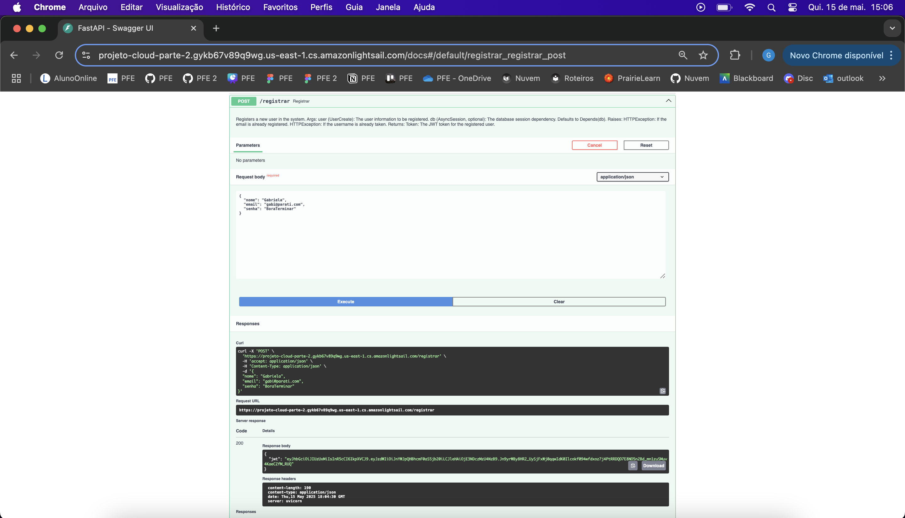
/// caption
Figura 4 - Endpoint de registro na AWS.
///

#### Tela de Consulta
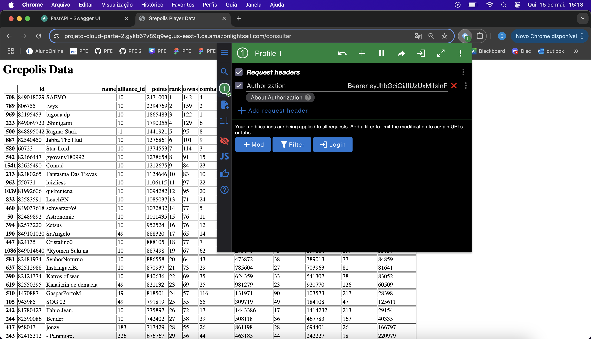
/// caption
Figura 5 - Endpoint de consulta na AWS.
///

#### Tela de Checagem da saúde
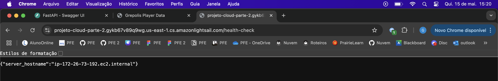
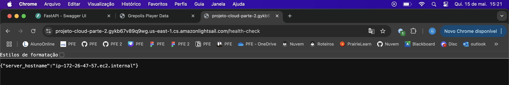
/// caption
Figura 6 - Endpoint de saúde, mostrando funcionamento do load balance.
///

### Screenshot da infraestrutura funcionando na AWS

#### Tela demonstrando funcionamento da aplicação
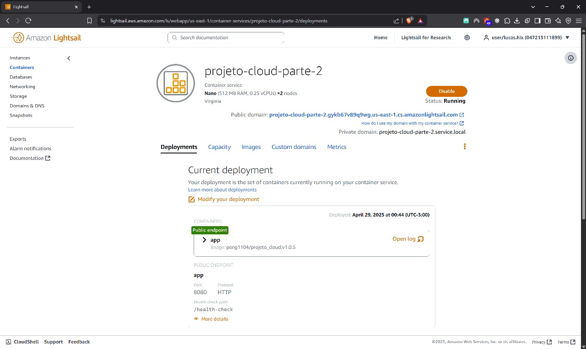
/// caption
Figura 7 - Aplicação funcionando.
///

#### Tela demonstrando a base de dados
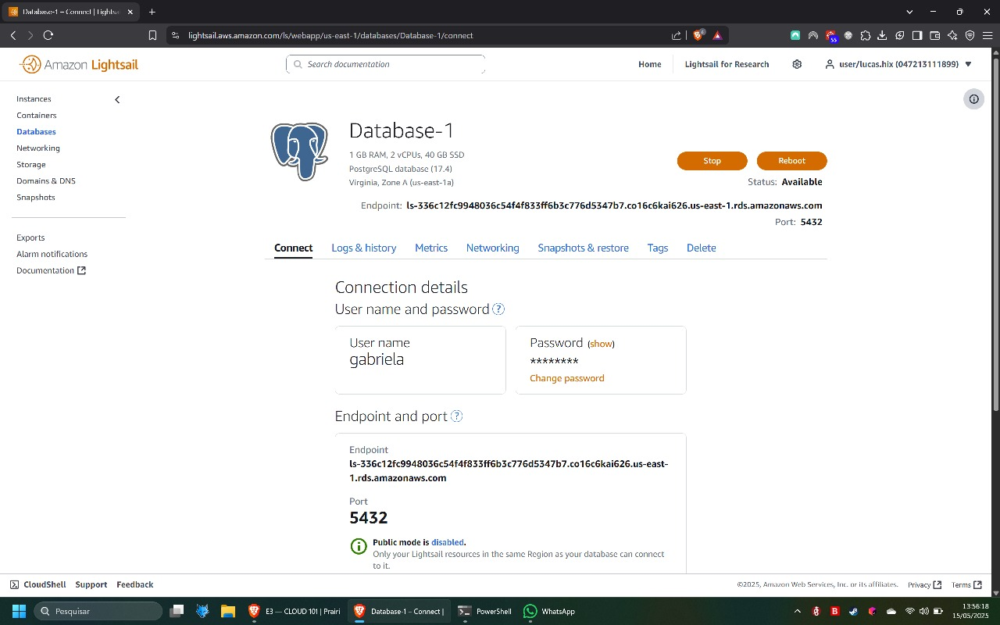
/// caption
Figura 8 - Base de dados.
///

### Custos

A seguir temos a Figura 9 com os preços dos containers de diferentes tamanhos.

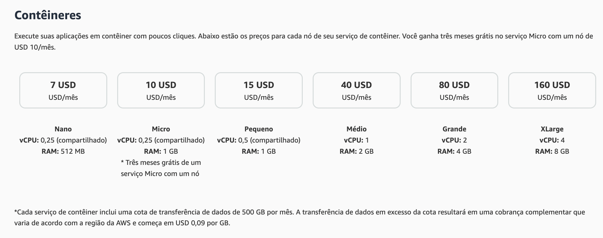
/// caption
Figura 9 - Custo dos containers.
///

A decisão foi de utilizar containers Nano, os quais possuem preço de 7 USD. O preço é linear, com um acréscimo de 7 USD a cada novo container, a utilização de 2 containers nesse projeto leva a um custo de 14 USD por mês (Figura 10).

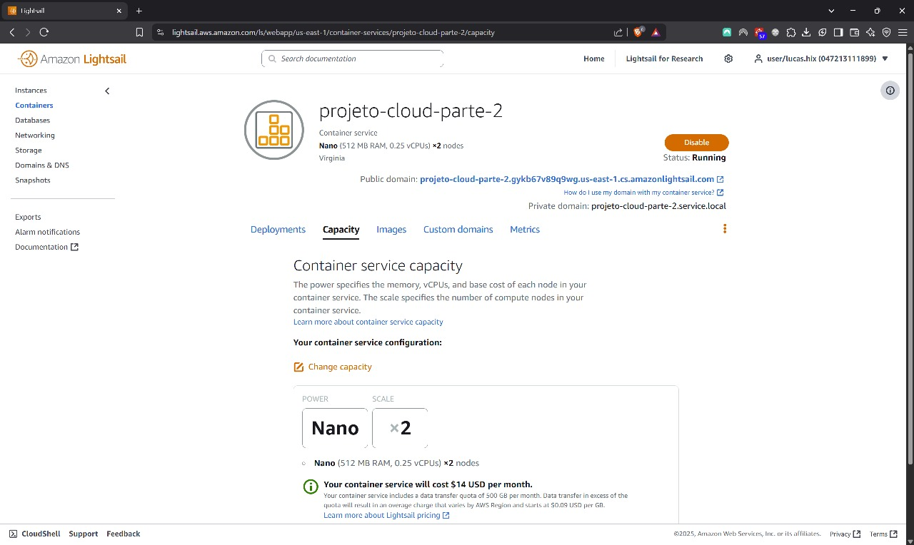
/// caption
Figura 10 - Custo dos 2 containers no projeto.
///

??? tip "Consultar preços"

    Para mais informações sobre os preços, consultar: [https://aws.amazon.com/pt/lightsail/pricing/](https://aws.amazon.com/pt/lightsail/pricing/){target:"_blank"}

???+ abstract "Projeção"

    Fazendo uma projeção do custo para 1, 5 e 10 instâncias de containers, chegamos nos dados da Tabela 1 a seguir:

    | Nº de containers |    Valor    |
    | :--------------: | :---------: |
    |        1         |    7 USD    |
    |        5         |    35 USD   | 
    |        10        |    70 USD   | 
    /// caption
    Tabela 1 - Projeção de preços.
    ///

Agora, levando em consideração que é utilizado um banco de dados, é apresentada a Figura 11, sendo adotado o Plano Standard de 15 USD por mês.

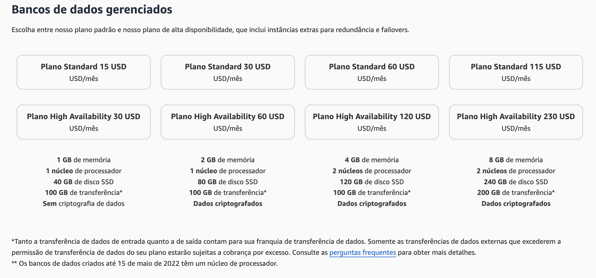
/// caption
Figura 11 - Custo dos bancos de dados.
///

Todas as escolhas de containers e banco de dados feitas são explicadas por serem os planos mais baratos que atendem às necessidades do projeto.

**Custos do projeto:**

|                |    Valor    |
| :------------: | :---------: |
|  2 containers  |    14 USD   |
|   1 banco      |    15 USD   | 
|   **TOTAL**    |  **29 USD** |
/// caption
Tabela 2 - Custos do projeto. 
///

O custo da conta no dia da submissão é mostrado na Figura 12 abaixo:

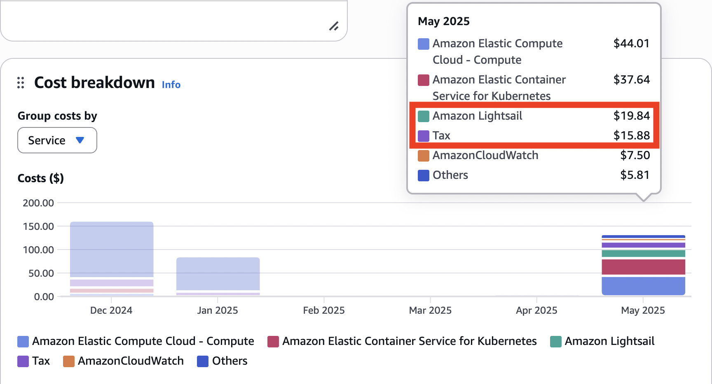
/// caption
Figura 12 - Custo final da conta.
///

## Arquitetura final 

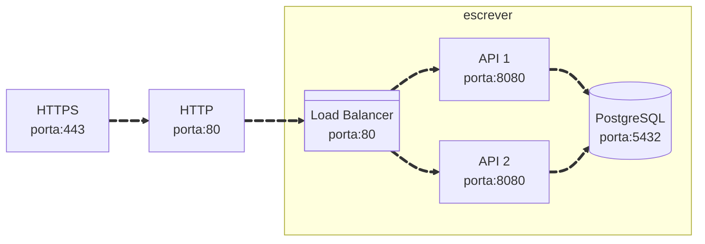

## Videos demonstrativos

Aqui estão dois vídeos demonstrativos das Etapas 1 e 2 do projeto:

<iframe width="560" height="315" src="https://www.youtube.com/embed/rpISwUK8aME" frameborder="0" allowfullscreen></iframe>
/// caption
Vídeo 1 - Etapa 1 do projeto.
///

<iframe width="560" height="315" src="" frameborder="0" allowfullscreen></iframe>
/// caption
Vídeo 2 - Etapa 2 do projeto.
///