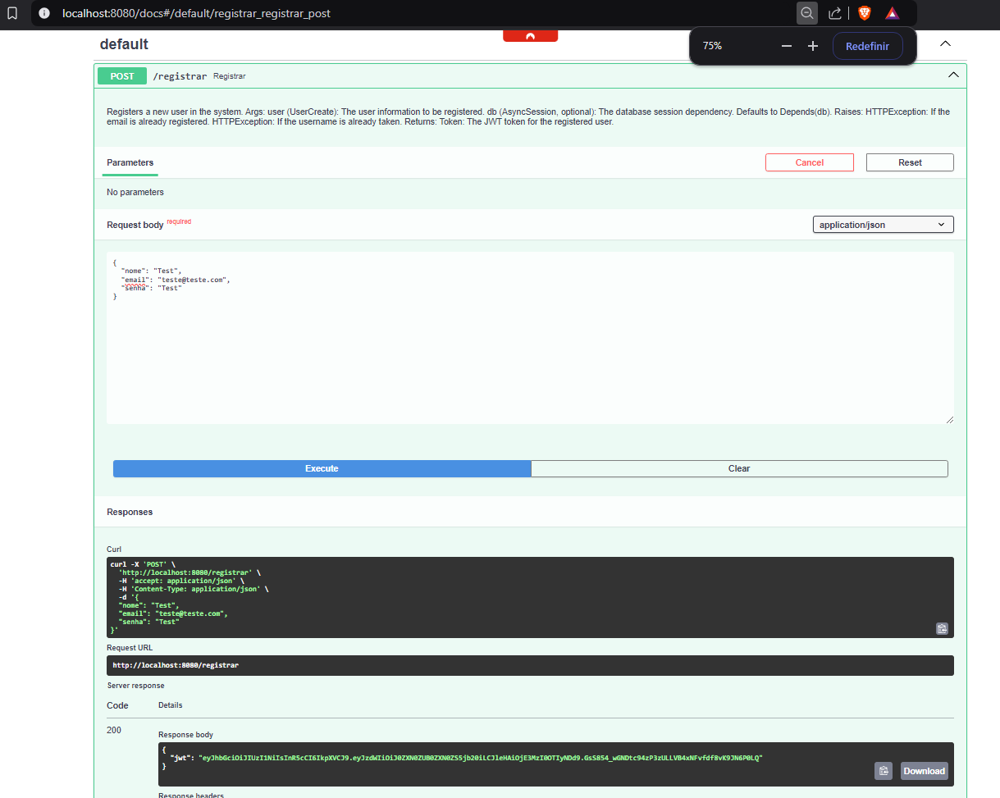
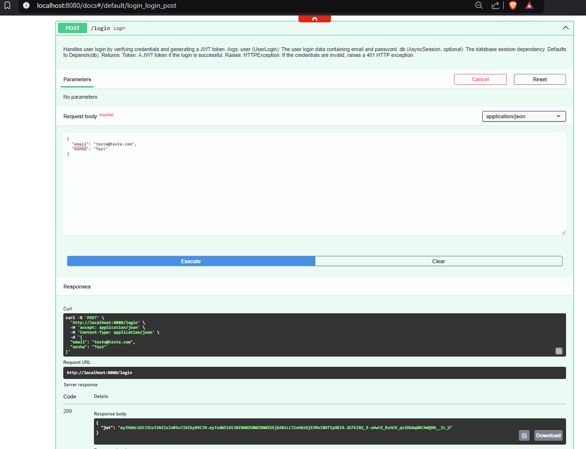
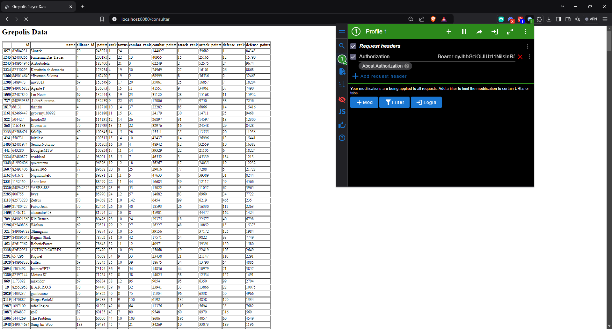

## Projeto

Link do Repositório: [https://github.com/Peng1104/Projeto-Cloud](https://github.com/Peng1104/Projeto-Cloud){:target="_blank"}

Este projeto é uma API FastAPI para manipulação de usuários e consulta de dados do jogo Grepolis.

## ETAPA 1

### O que foi feito?

Foram feitos os endopoints, modelos e configurações necessárias para criar uma aplicação que permite o cadastro e autenticação de usuários, além da consulta de dados dos jogadores do jogo Grepolis.

Os dados obtidos através de endpoints específicos do Grepolis são combinados em um DataFrame para facilitar a manipulação e exibição, atualizados de hora em hora.

O projeto possui a seguinte estrutura de pastas e arquivos:

``` tree title="Estrutura"
app/
  Dockerfile
  requirements.txt
  .dockerignore
  web_app/
    __main__.py
    app_models.py
    app_routes.py
    db_manager.py
    db_models.py
    grepolis_data.py
    jwt_manager.py
docs/
  imgs/
    ...
.env
.gitignore
compose.yml
```

### Endpoints

#### Registrar Usuário

- **URL:** `/registrar`
- **Método:** `POST`
- **Descrição:** Registra um novo usuário no banco de dados.
- **Parâmetros:**
    - `user` (UserCreate): Informações do usuário a ser registrado.
    - `db` (AsyncSession, opcional): A base de dados da sessão, fornecido pela dependência `Depends(get_database)`, com a dependência Default `Depends(db)`.
- **Retorno:**
    - `Token`: O token JWT para o usuário registrado.
- **Erros:**
    - `400`: Email já registrado.
    - `400`: Nome indisponível.

#### Login

- **URL:** `/login`
- **Método:** `POST`
- **Descrição:** Lida com o login do usuário, verificando as credenciais e gerando um token JWT.
- **Parâmetros:**
    - `user` (UserLogin): Dados de login do usuário contendo email e senha.
    - `db` (AsyncSession, opcional): A base de dados da sessão, fornecido pela dependência `Depends(get_database)`, com a dependência Default `Depends(db)`.
- **Retorno:**
    - `Token`: Um token JWT se o login for bem-sucedido.
- **Erros:**
    - `401`: Credenciais inválidas.

#### Consultar Dados

- **URL:** `/consultar`
- **Método:** `GET`
- **Descrição:** Valida um token e retorna os dados dos jogadores do Grepolis em formato HTML.
- **Parâmetros:**
    - `payload` (dict): O token a ser validado. Este é fornecido pela dependência `Depends(validate_token)`.
- **Retorno:**
    - `HTMLResponse`: Contém os dados dos jogadores do Grepolis em formato HTML.
- **Erros:**
    - `403`: Token inválido ou expirado.

#### Health Check

- **URL:** `/health-check`
- **Método:** `GET`
- **Descrição:** Verifica o status do servidor.
- **Retorno:**
    - `dict`: Um dicionário contendo o hostname do servidor.
    - `200`: Solicitação processada com sucesso e o servidor funcionando corretamente.

### Modelos

#### UserCreate

- **Descrição:** Modelo Pydantic usado para criar um novo usuário.
- **Atributos:**
    - `nome` (str): Nome do usuário.
    - `email` (str): Endereço de email do usuário.
    - `senha` (str): Senha do usuário.

#### UserLogin

- **Descrição:** Modelo Pydantic para informações de login do usuário.
- **Atributos:**
    - `email` (str): Endereço de email do usuário.
    - `senha` (str): Senha do usuário.

#### Token

- **Descrição:** Modelo representando um JSON Web Token (JWT).
- **Atributos:**
    - `jwt` (str): O token JWT como uma string.

### Como executar

1. Crie um arquivo `docker-compose.yml` com o seguinte conteúdo:
    ```yaml
    services:
      app:
        image: peng1104/projeto_cloud:v1.0.5
        ports:
          - "8080:8080"
        volumes:
          - ./app:/app
        env_file:
          - .env
        depends_on:
          - database

      database:
        image: postgres:latest
        restart: always
        env_file:
          - .env
        volumes:
          - postgres-data:/var/lib/postgresql/data

    volumes:
      postgres-data:
    ```

2. Configure as variáveis de ambiente no arquivo `.env`. 

    **Exemplo**:
    ```env
    POSTGRES_HOST=postgres
    POSTGRES_PORT=5432
    POSTGRES_DB=db_app
    POSTGRES_USER=humberto
    POSTGRES_PASSWORD=gabriela

    APP_PORT=8080
    JWT_SECRET=750fc55c0a404f8485580fd4bbcf6d7e
    ```

3. Execute a aplicação:
    ```sh
    docker run --env-file .env -p 8080:8080 peng1104/projeto_cloud:v1.0.5
    ```

### Docker

Você também pode executar a aplicação usando Docker:

1. Construa a imagem Docker:
    ```sh
    docker build -t projeto_cloud .
    ```
2. Execute os containers usando Docker Compose:
    ```sh
    docker-compose up
    ```

### Publicação no Docker

Para publicar a imagem no Docker Hub, foram ultilizados os seguintes comandos:

1. Faça login no Docker Hub:
  ```sh
  docker login
  ```

2. Construa a imagem Docker:
  ```sh
  docker build -t peng1104/projeto_cloud:v1.0.5 .
  ```

3. Faça o push da imagem para o Docker Hub:
  ```sh
  docker push peng1104/projeto_cloud:v1.0.5
  ```

Certifique-se de substituir `seu_usuario_docker` pelo seu nome de usuário no Docker Hub.

### Imagem Docker

Disponível em: [peng1104/projeto_cloud](https://hub.docker.com/r/peng1104/projeto_cloud)

### Screenshots dos Endpoints

#### Tela de Registro

/// caption
Figura 1 - Endpoint de registro.
///

#### Tela de Login

/// caption
Figura 2 - Endpoint de login.
///

#### Tela de Consulta

/// caption
Figura 3 - Endpoint de consulta.
///

## ETAPA 2

### O que foi feito?

- explicação do projeto - scrap do que foi feito;

- Explicação sobre a integração app ↔ banco (host, porta, segurança, variáveis)
- Explicação do Banco de Dados instalado em Instancia no Ligthsail e conectado a aplicação

### Como executar

 - explicação de como executar a aplicação;

### Screenshots dos Endpoints

- screenshot com os endpoints AWS testados;


/// caption
Figura X - .
///

### Screenshot da infraestrutura funcionando na AWS

- screenshot da infraestrutura funcionando na AWS;


/// caption
Figura X - .
///

### Custos

- tela dos custos da conta no mesmo dia da submissão dos documentos;


/// caption
Figura X - .
///

#### Projetar para 1, 5 e 10 instâncias de containers

- para conceito B, na documentação dos custos deve ser projetado para: 1, 5 e 10 instancias de containers;

## Arquitetura final 

- Apresentar a arquitetura final do projeto em diagrama

## Videos demonstrativos

Aqui estão dois vídeos demonstrativos das Etapas 1 e 2 do projeto:

- video de execução da aplicação - de até 1 minuto;

<iframe width="560" height="315" src="https://www.youtube.com/embed/rpISwUK8aME" 
frameborder="0" allowfullscreen></iframe>
/// caption
Vídeo 1 - Etapa 1 do projeto.
///


/// caption
Vídeo 2 - Etapa 2 do projeto.
///
- video de execução da aplicação funcionando no Ligthsail - de até 1 minuto mostrando o acesso e a gravação de dados no banco de dados em Cloud;