## Objetivo

O objetivo principal desse roteiro é:

- entender os conceitos básicos sobre uma plataforma de gerenciamento de hardware
- introduzir conceitos básicos sobre redes de computadores

## Roteiro

Para visualizar o arquivo PDF feito e entregue, consultar o link a seguir: **[Roteiro 1 - PDF](./Roteiro_1_de_Cloud.pdf)**.

## Montagem do Roteiro

!!! warning

    O formato e a quantidade de tarefas do roteiro feito (em 2024.2) é diferente do enunciado (de 2025.1), porém comentários são feitos para melhor compreensão e é majoritariamente seguido o mesmo conteúdo.

### Infra

Para criar a infraestrutura, foram instalados o Ubuntu e o MaaS, realizando todas as configurações necessárias.

### **Parte I**

Deploy do Ubuntu, instalar a aplicação PostgreSQL e criar uma base de dados.

??? Tarefa-1

    Estude os comandos ping, ifconfig, systemctl, telnet, ufw, curl, wget e journalctl. Com estes comandos apresente prints das Telas  que provam que o banco de dados está:
    
        1. Funcionando e seu Status está como "Ativo" para o Sistema Operacional
        2. Acessivel na própria maquina na qual ele foi implantado.
        3. Acessivel a partir de uma conexão vinda da máquina MAIN.
        4. Em qual porta este serviço está funcionando.
        
    **No roteiro que fizemos essas telas não foram requeridas**.

### **Parte II**

Subir uma aplicação Django. 

??? Tarefa-2

    De um print das Telas abaixo:
    
        1. Do Dashboard do **MAAS** com as máquinas.
        1. Da aba images, com as imagens sincronizadas.
        1. Da Aba de cada maquina(5x) mostrando os testes de hardware e commissioning com Status "OK"

    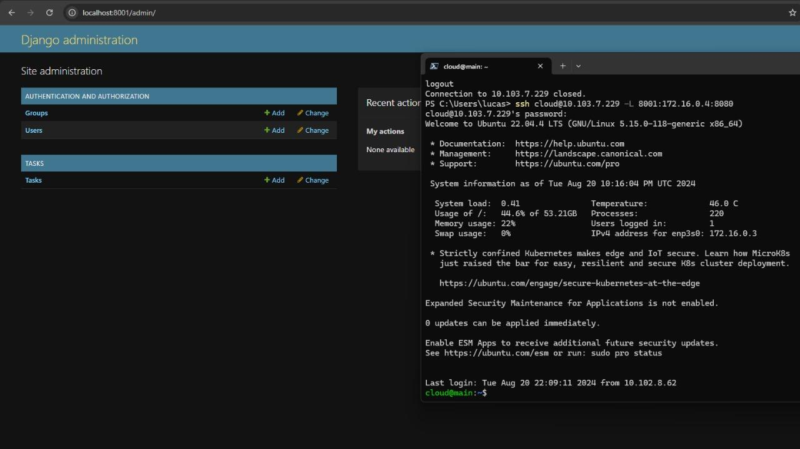
    /// caption
    Figura 1 - Painel Django acessado via tunelamento 
    ///

    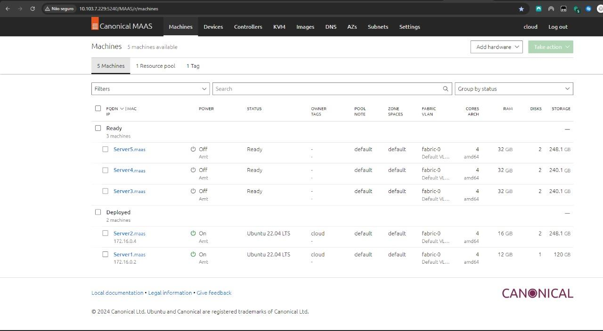
    /// caption
    Figura 2 - Dashboard do MAAS com as máquinas 
    ///

    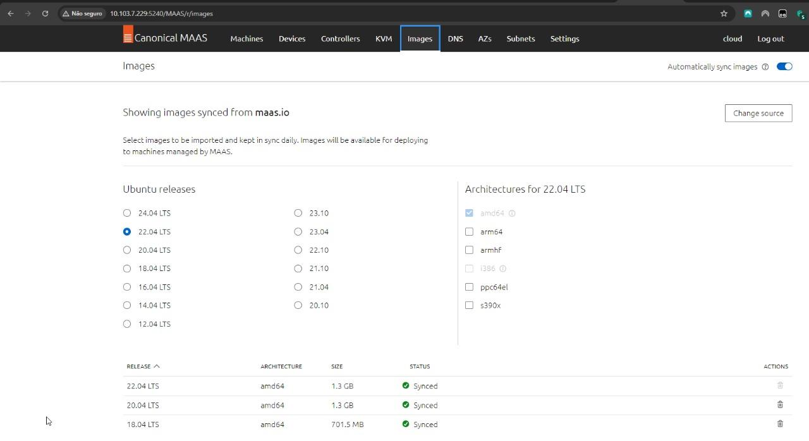
    /// caption
    Figura 3 - Aba imagens, com as imagens sincronizadas
    ///

    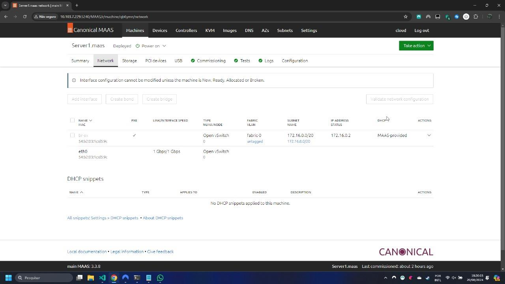
    /// caption
    Figura 4 - Server 1: Network
    ///

    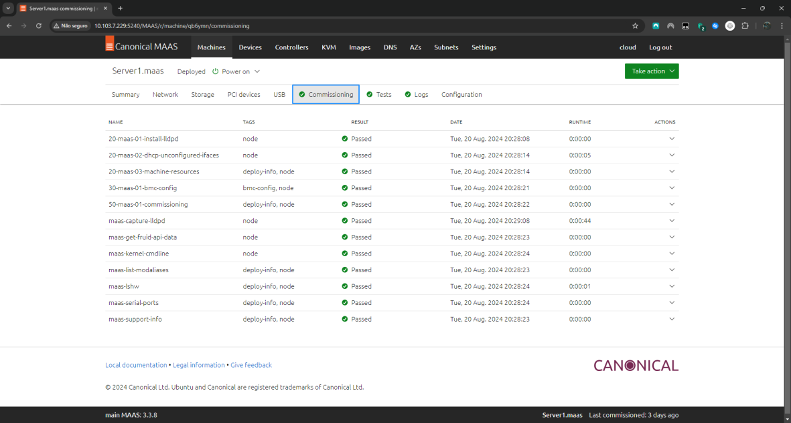
    /// caption
    Figura 5 - Server 1: Commissioning 
    ///

    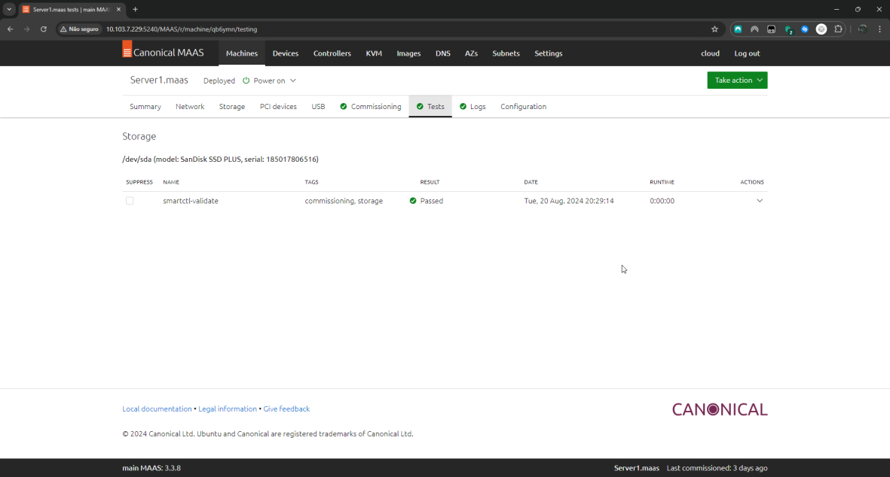
    /// caption
    Figura 6 - Server 1: Testes 
    ///

    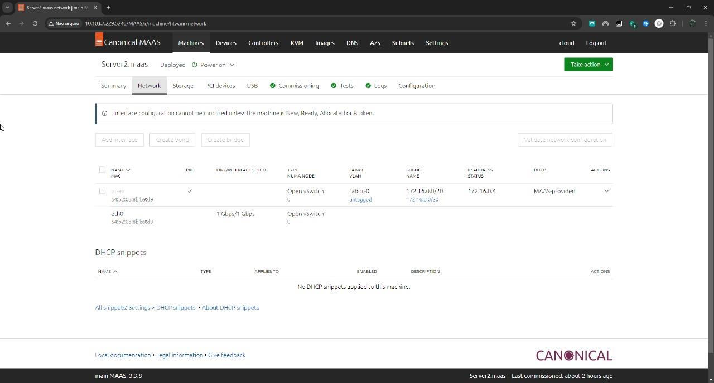
    /// caption
    Figura 7 - Server 2: Network 
    ///

    
    /// caption
    Figura 8 - Server 2: Commissioning
    ///

    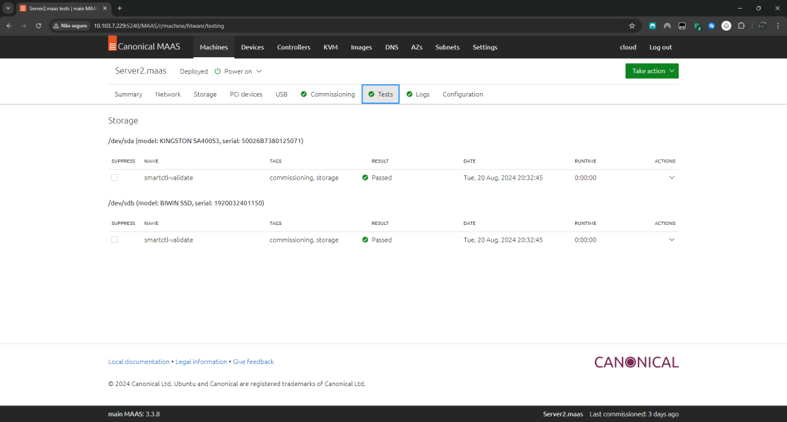
    /// caption
    Figura 9 - Server 2: Testes 
    ///

    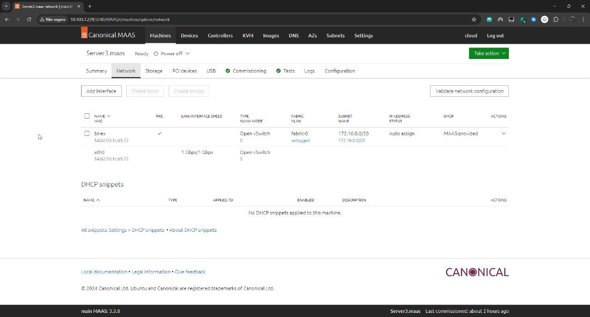
    /// caption
    Figura 10 - Server 3: Network
    ///

    
    /// caption
    Figura 11 - Server 3: Commissioning
    ///

    
    /// caption
    Figura 12 - Server 3: Tests
    ///

    
    /// caption
    Figura 13 - Server 4: Network 
    ///

    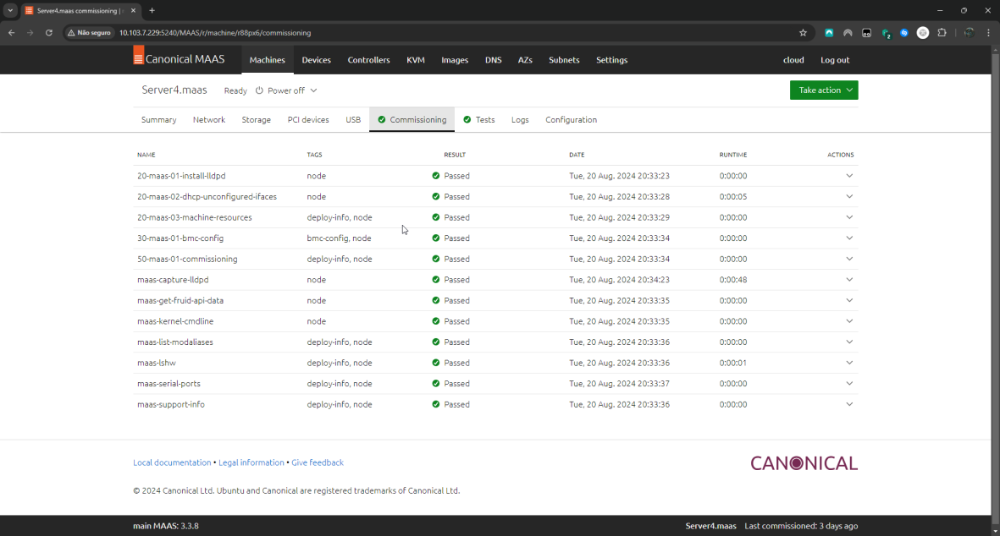
    /// caption
    Figura 14 - Server 4: Commissioning 
    ///

    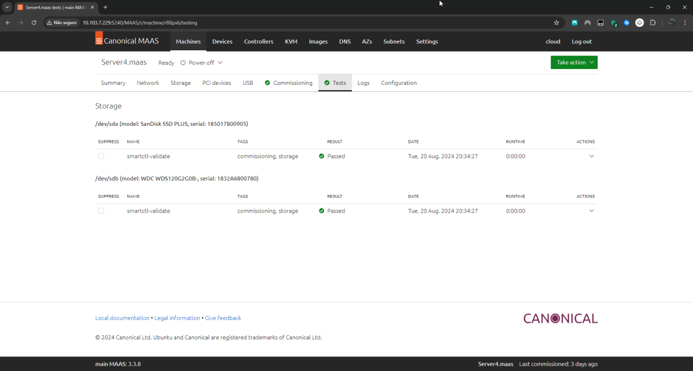
    /// caption
    Figura 15 - Server 4: Tests  
    ///

    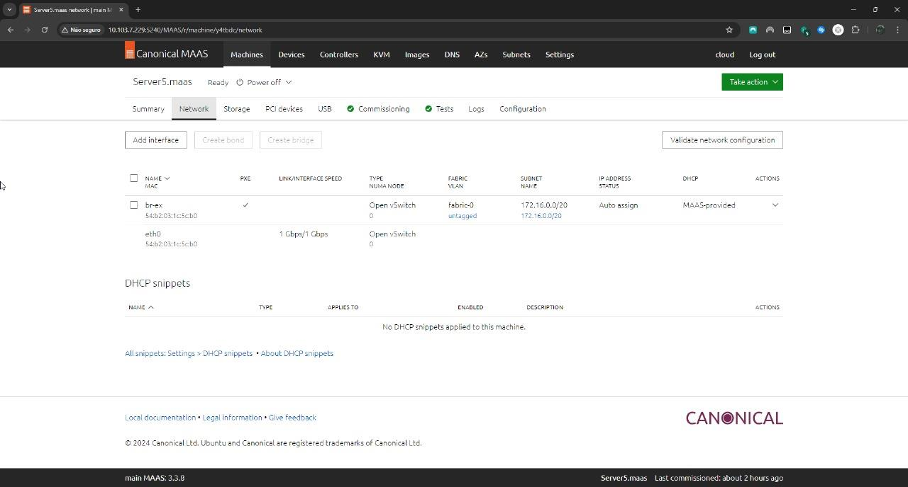
    /// caption
    Figura 16 - Server 5: Network 
    ///

    
    /// caption
    Figura 17 - Server 5: Comissioning  
    ///

    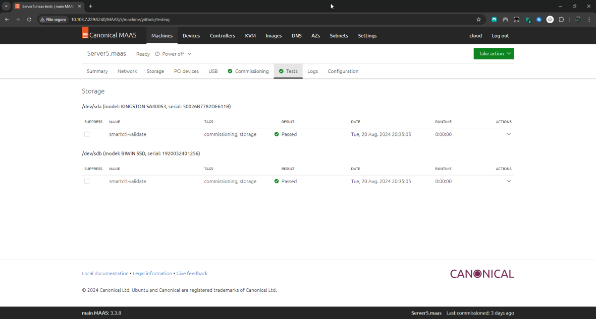
    /// caption
    Figura 18 - Server 5: Tests 
    ///

Utilizando o Ansible - deploy automatizado de aplicação.

??? Tarefa-3

    1. De um print da tela do Dashboard do MAAS com as 2 Maquinas e seus respectivos IPs.
    2. De um print da aplicacao Django, provando que voce está conectado ao server 
    3. Explique como foi feita a implementacao manual da aplicacao Django e banco de dados.

    **No roteiro que fizemos, ESSA TAREFA FOI PEDIDA NO ROTEIRO 2, mas colocamos as respostas abaixo:** 

    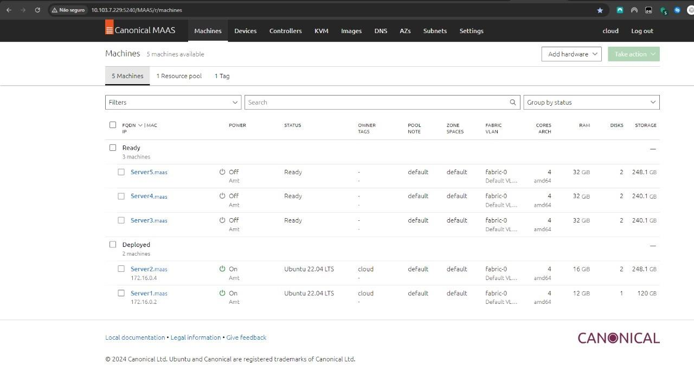
    /// caption
    Figura 19 - Dashboard do MAAS com as 2 máquinas 
    /// 
    
    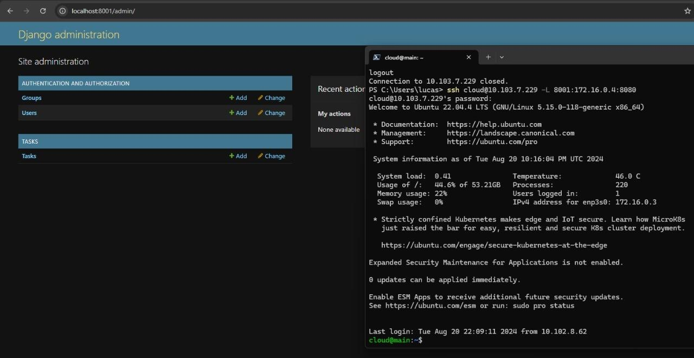
    /// caption
    Figura 20 - Painel Django acessado via tunelamento 
    ///
     
    **Explique como foi feita a implementação manual da aplicação Django e banco de dados.**
    
    Fazer toda a conexão com o MAAS e logar no MAAS, para poder conectar à máquina e realizar seu deploy. Depois, fazer git clone e install para deixar o ambiente django pronto para o seu uso. 

Subindo uma aplicação Django utilizando o Ansible.

??? Tarefa-4

    Teste o acesso, caso esteja tudo certo, faça a tarefa abaixo
    
        1. De um print da tela do Dashboard do MAAS com as 3 Maquinas e seus respectivos IPs.
        2. De um print da aplicacao Django, provando que voce está conectado ao server2 
        3. De um print da aplicacao Django, provando que voce está conectado ao server3 
        4. Explique qual diferenca entre instalar manualmente a aplicacao Django e utilizando o Ansible.

    **No roteiro que fizemos, ESSA TAREFA FOI PEDIDA NO ROTEIRO 2, mas colocamos as respostas abaixo:**

    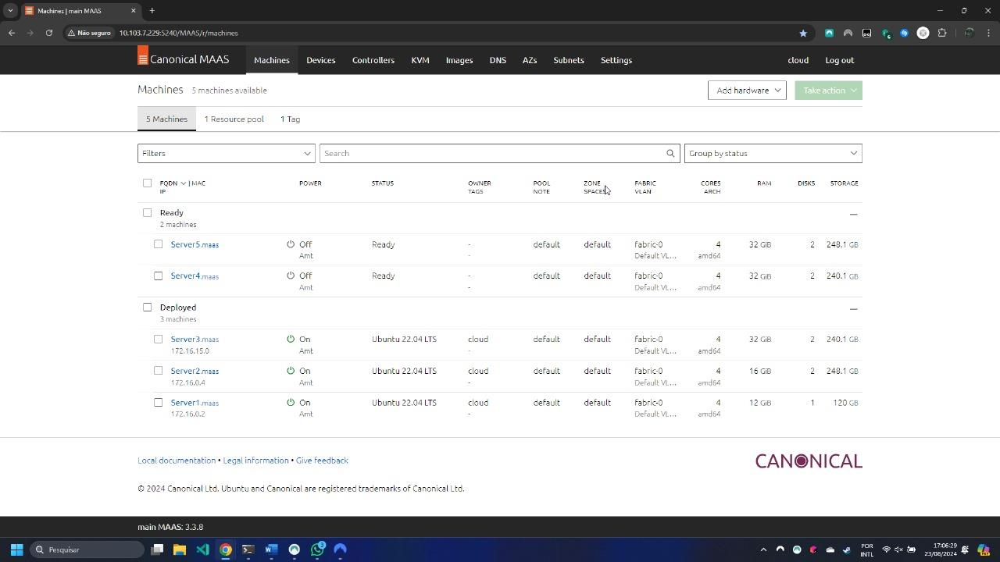
    /// caption
    Figura 21 - Dashboard do MAAS com as 3 máquinas 
    /// 
    
    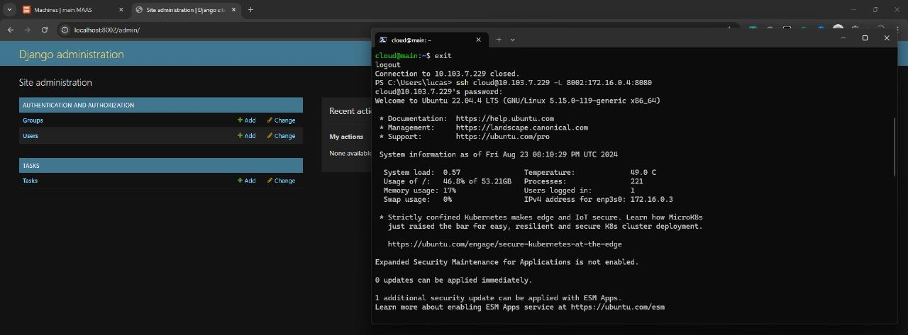
    /// caption
    Figura 22 - Aplicação Django provando que está conectado ao Server 2 
    /// 
    
    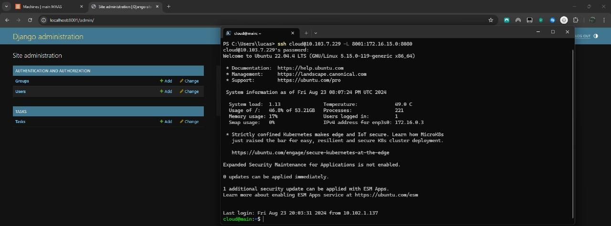
    /// caption
    Figura 23 - Aplicação Django provando que está conectado ao Server 3 
    ///
    
    **Explique  qual  a  diferença  entre  instalar  manualmente  a  aplicação  Django  e utilizando o Ansible.**
    
    A diferença é que, com o deploy feito no server, pode-se usar o Ansible para preparar o ambiente para a aplicação do django.

Balanceamento de carga usando Proxy Reverso, é instalando o nginx.

??? Tarefa-5

    Teste o acesso, caso esteja tudo certo, faça a tarefa abaixo:

        1. De um print da tela do Dashboard do MAAS com as 4 Maquinas e seus respectivos IPs.
        2. Altere o conteúdo da mensagem contida na função `index` do arquivo `tasks/views.py` de cada server para distinguir ambos os servers. 
        3. Faça um `GET request` para o path que voce criou em urls.py para o Nginx e tire 2 prints das respostas de cada request, provando que voce está conectado ao server 4, que é o Proxy Reverso e que ele bate cada vez em um server diferente server2 e server3.  

    **No roteiro que fizemos, ESSA TAREFA FOI PEDIDA NO ROTEIRO 2, mas colocamos as respostas abaixo:**

    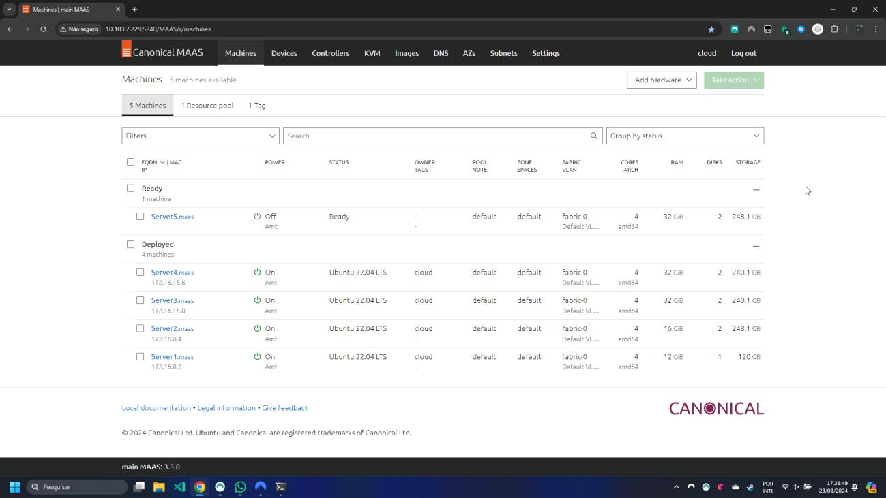
    /// caption
    Figura 24 - Dashboard do MAAS com as 4 máquinas
    ///
    
    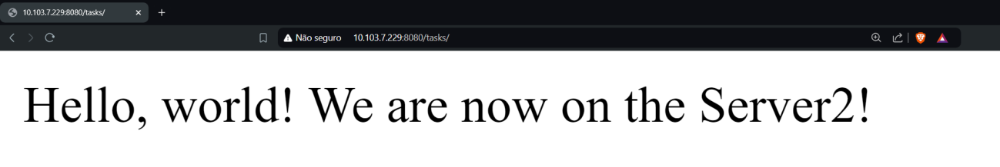
    /// caption
    Figura 25 - Resposta do request conectado ao Server2 
    ///
    
    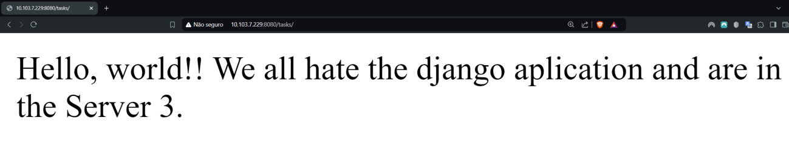
    /// caption
    Figura 26 - Resposta do request conectado ao Server3 
    /// 

Agora finalizando, é feito um release de todos os nós no kit.

## Conclusão

Este roteiro aborda o provisionamento e gerenciamento de infraestrutura Bare Metal com MaaS, permitindo tratar servidores físicos como uma nuvem privada. A instalação do PostgreSQL garante maior controle sobre o desempenho e segurança do banco de dados, essencial para aplicações de grande porte.

O uso do Ansible automatiza o deploy da aplicação Django, reforçando a importância da infraestrutura como código (IaC) para padronização e eficiência operacional. Além disso, a implementação do Nginx como proxy reverso melhora a escalabilidade e a disponibilidade da aplicação, distribuindo a carga de forma eficiente.

O aprendizado adquirido reforça práticas essenciais de DevOps, automação e escalabilidade para aplicações modernas.