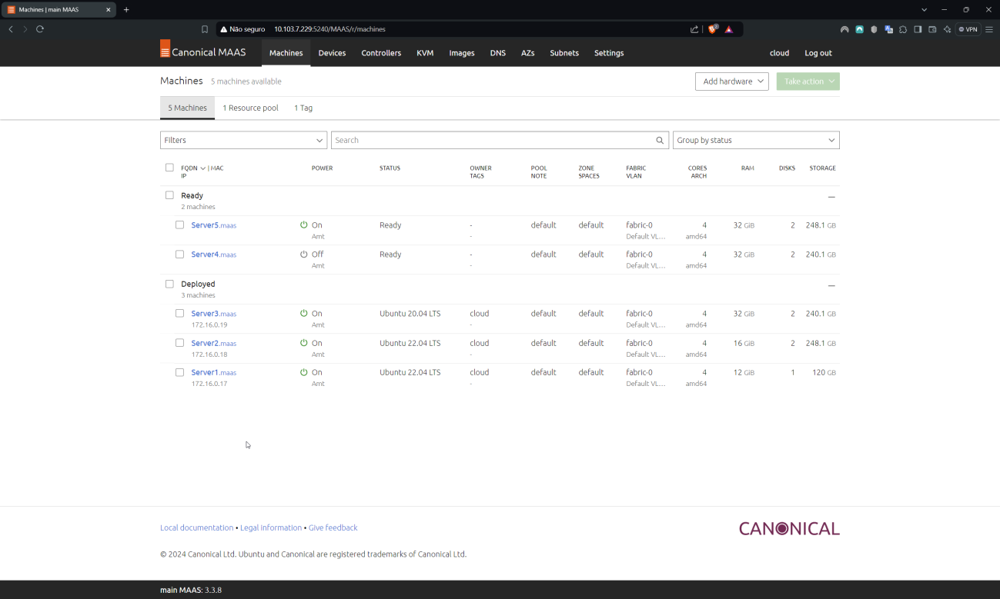
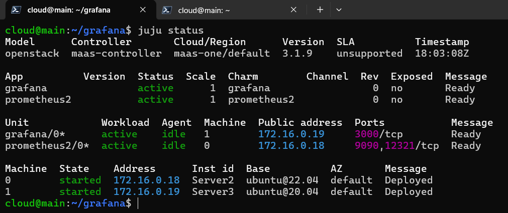
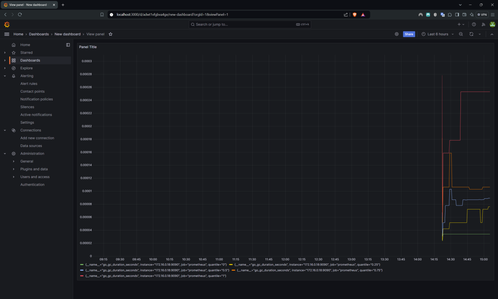
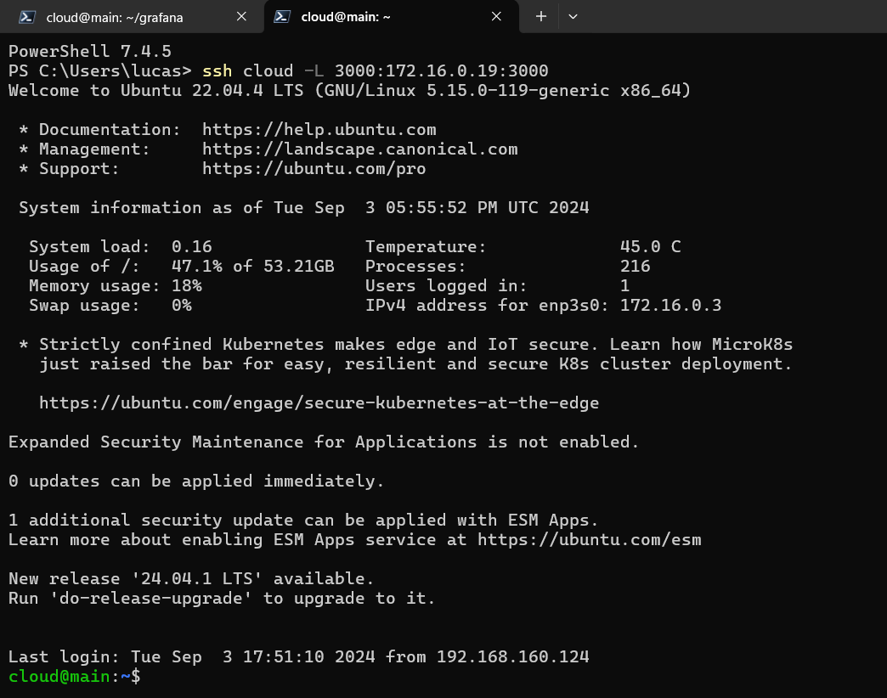

## Objetivo

O objetivo principal desse roteiro é:

- entender os conceitos básicos sobre uma plataforma de gerenciamento de aplicações distribuídas
- entender os conceitos básicos de comunicação entre aplicações e serviços

## Roteiro

Para visualizar o arquivo PDF feito e entregue, consultar o link a seguir: **[Roteiro 2 - PDF](./Roteiro_2_de_Cloud.pdf)**.

## Montagem do Roteiro

!!! warning

    O formato e a quantidade de tarefas do roteiro feito (em 2024.2) é diferente do enunciado (de 2025.1), porém comentários são feitos para melhor compreensão e é majoritariamente seguido o mesmo conteúdo.

### Infra

Para criar a infraestrutura, foi instalado o Juju, realizando todas as configurações necessárias.

### Deployment Orchestration

Instalados o Dashboard do Juju, o Grafana e o Prometheus, e é feito o deploy das aplicações Grafana e Prometheus com o auxilio do Juju. Por fim, integra-se o Grafana com o Prometheus.

??? Tarefa-1

    1. De um print da tela do Dashboard do MAAS com as Maquinas e seus respectivos IPs.
    2. De um print de tela do comando "juju status" depois que o Grafana estiver "active". 
    3. De um print da tela do Dashboard do Grafana com o Prometheus aparecendo como source.
    4. Prove (print) que você está conseguindo acessar o Dashboard a partir da rede do Insper.
    5. De um print na tela que mostra as aplicações sendo gerenciadas pelo JUJU (http://IP-Serviço:8080/models/admin/maas)
        
    **No roteiro que fizemos as telas dos pontos 4 e 5 não foram requeridas**.

    
    /// caption
    Figura 1 - Dashboard do MAAS com as máquinas e seus respectivos IPs 
    ///  

    
    /// caption
    Figura 2 - Comando “juju status” com o Grafana ativo 
    /// 

    
    /// caption
    Figura 3 - Dashboard do Grafana com o Prometheus aparecendo como source 
    ///

    
    /// caption
    Figura 4 - Comando do tunelamento com o Grafana 
    ///

## Conclusão

Este roteiro demonstra o uso do Juju para orquestração de deployment em infraestrutura Bare Metal, simplificando a configuração e gerenciamento de serviços. A instalação do Juju Dashboard facilita a administração visual da infraestrutura, melhorando a usabilidade e monitoramento.

A utilização do Juju para implantar o Grafana e o Prometheus destaca a automação no gerenciamento de aplicações, reduzindo a complexidade do deploy e garantindo consistência na configuração. A integração entre essas ferramentas permite a coleta e visualização de métricas em tempo real, essencial para a observabilidade e monitoramento eficaz da infraestrutura.