## Objetivo

O objetivo principal desse roteiro é:

- entender os conceitos básicos de Private Cloud
- aprofundar conceitos sobre redes virtuais SDN

## Roteiro

Para visualizar o arquivo PDF feito e entregue, consultar o link a seguir: **[Roteiro 3 - PDF](./Roteiro_3_de_Cloud.pdf)**.

## Montagem do Roteiro

O OpenStack é um conjunto de componentes de software que oferecem serviços comuns para a infraestrutura de cloud.

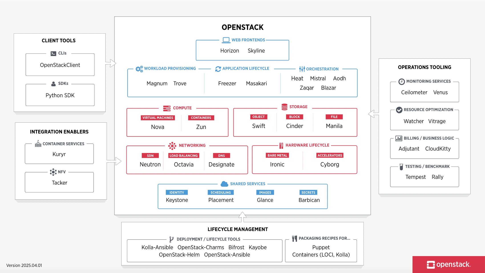
/// caption
Figura 1 - OpenStack. Fonte: [https://www.openstack.org/](https://www.openstack.org/){target=_blank}
///

## Infra (Nuvem VM) - Servidor Virtual Privado (VPS)

O OpenStack permitirá distribuir virtual machines usando os nós disponíveis no kit, mas antes de iniciar a instalação, deve-se verificar se o MAAS está configurado corretamente.

A documentação oficial do OpenStack está presente no link a seguir: [Implantação do OpenStack](https://docs.openstack.org/project-deploy-guide/charm-deployment-guide/latest/install-openstack.html#openstack-release){target=_blank}

### Implantação do OpenStack

- Nesse ambiente, o Juju controller deve estar instalado no server1;
- Para monitorar o status da instalação, usar o comando:
``` sh
watch -n 2 --color "juju status --color"
```

!!! warning
    
    No caso de problemas durante a instalação, dependendo da gravidade do problema, é mais simples limpar a instalação e reiniciar desde **1 - Juju Controller**.

    ``` sh
    juju kill-controller maas-controller
    ```

!!! Aviso

    O roteiro feito, em 2024.2, possui uma versão antiga dos comandos utilizados. Durante essa documentação do roteiro, serão apresentados os comandos utilizados na realização do roteiro, e os comandos atualizados estarão apresentados em notas intituladas **Nova-versão**.

### 1 - Juju Controller

Apenas se ainda não tiver um Juju Controller, adicionar a tag controller na máquina server1:

``` sh
juju bootstrap --bootstrap-series=jammy --constraints tags=controller maas-one maas-controller
```

### 2 - Modelo de deploy

``` sh
juju add-model --config default-series=jammy openstack
juju switch maas-controller:openstack
```

### 3 - Ceph OSD

O aplicativo ceph-osd é implantado em três nós usando o charm ceph-osd, com os dispositivos de armazenamento /dev/sda e /dev/sdb configurados para uso em todos os nós. A implantação utiliza a tag compute, definida previamente nos nós via MAAS, e é realizada com o comando juju deploy especificando três unidades e a configuração dos dispositivos. Para fazer o deploy da aplicação ceph-osd:

``` sh
juju deploy -n 3 --channel reef/stable --config ceph-osd.yaml --constraints tags=compute ceph-osd
```

??? Nova-versão
    ``` sh
    juju deploy -n 3 --channel quincy/stable --config ceph-osd.yaml --constraints tags=compute ceph-osd
    ```

### 4 - Nova Compute

O nova-compute, responsável por provisionar instâncias de computação no OpenStack, deve ser implantado nos nós de computação usando os IDs das máquinas (0, 1 e 2), pois não há mais nós MAAS disponíveis. Isso implica em compartilhar os mesmos nós entre múltiplos serviços. Para o deploy:

``` sh
juju deploy -n 2 --to 1,2 --channel 2023.2/stable --config nova-compute.yaml nova-compute
```

??? Nova-versão
    ``` sh
    juju deploy -n 3 --to 0,1,2 --channel yoga/stable --config nova-compute.yaml nova-compute
    ```

### 5 - MySQL InnoDB Cluster

MySQL InnoDB Cluster requer no mínimo 3 unidades de banco de dados, e ele deve implantado com o atributo mysql-innodb-cluster, estão são conteinerizados nas máquinas 0, 1 e 2, fazendo o deploy como indicado:

``` sh
juju deploy -n 3 --to lxd:0,lxd:1,lxd:2 --channel 8.0/stable mysql-innodb-cluster
```

### 6 - Vault

O Vault é gerencia os certificados TLS que permitirão a comunicação criptografada entre aplicativos em nuvem, e ele será conteinerizado na máquina 2:

``` sh
juju deploy --to lxd:0 --channel 1.8/stable vault
```

??? Nova-versão
    ``` sh
    juju deploy --to lxd:2 vault --channel 1.8/stable
    ```

Os passos a seguir seguem o processo a seguir, com os seus comandos correspondentes:

- criar instância específica do mysql-router com o charme subordinado mysql-router;
- adicionar relação entre instância mysql-router e o banco de dados;
- adicionar relação entre instância mysql-router e o aplicativo.

``` sh
juju deploy --channel 8.0/stable mysql-router vault-mysql-router
juju integrate vault-mysql-router:db-router mysql-innodb-cluster:db-router
juju integrate vault-mysql-router:shared-db vault:shared-db
```

Para o Vault ser inicializado, desbloqueado e autorizado, são executados os comandos a seguir com os seguintes propósitos:

- Instalando o cli do Vault;
- Configurando o cli;
- Gerando-os;
- Remover o selo de 3 teclas (usar esse comando 3 vezes);
- Confirgurando o token;
- Gerando um token (tempo dos próximos passos de 10 minutos);
- Autorizando.

``` sh
sudo snap install vault
export VAULT_ADDR="http://<IP of vault>:8200"
vault operator init -key-shares=5 -key-threshold=3
vault operator unseal <Unseal Key>
export VAULT_TOKEN=<Initial Root Token>
vault token create -ttl=10m
juju run vault/0 authorize-charm token=<Token generated in the last command>
```

??? Nova-versão
    ``` sh
    juju run vault/leader authorize-charm token=<Token generated in the last command>
    ```

Para o Vault, é preciso um certificado de CA autoassinado para que ele possa emitir certificados para serviços de API em nuvem.

``` sh
juju run vault/0 generate-root-ca
```

??? Nova-versão
    ``` sh
    juju run vault/leader generate-root-ca
    ```

Os aplicativos em nuvem são habilitados para TLS por meio da relação vault:certificates, e a seguir, começa-se com o banco de dados em nuvem.

``` sh
juju integrate mysql-innodb-cluster:certificates vault:certificates
```

### 7 - Neutron Networking

``` sh
juju deploy -n 3 --to lxd:0,lxd:1,lxd:2 --channel 23.09/stable ovn-central
juju deploy --to lxd:1 --channel 2023.2/stable --config neutron.yaml neutron-api
juju deploy --channel 2023.2/stable neutron-api-plugin-ovn
juju deploy --channel 23.09/stable --config neutron.yaml ovn-chassis
```

??? Nova-versão
    ``` sh
    juju deploy -n 3 --to lxd:0,lxd:1,lxd:2 --channel 22.03/stable ovn-central
    juju deploy --to lxd:1 --channel yoga/stable --config neutron.yaml neutron-api
    juju deploy --channel yoga/stable neutron-api-plugin-ovn
    juju deploy --channel 22.03/stable --config neutron.yaml ovn-chassis
    ```

``` sh 
juju integrate neutron-api-plugin-ovn:neutron-plugin neutron-api:neutron-plugin-api-subordinate
juju integrate neutron-api-plugin-ovn:ovsdb-cms ovn-central:ovsdb-cms
juju integrate ovn-chassis:ovsdb ovn-central:ovsdb
juju integrate ovn-chassis:nova-compute nova-compute:neutron-plugin
juju integrate neutron-api:certificates vault:certificates
juju integrate neutron-api-plugin-ovn:certificates vault:certificates
juju integrate ovn-central:certificates vault:certificates
juju integrate ovn-chassis:certificates vault:certificates
```

``` sh
juju deploy --channel 8.0/stable mysql-router neutron-api-mysql-router
juju integrate neutron-api-mysql-router:db-router mysql-innodb-cluster:db-router
juju integrate neutron-api-mysql-router:shared-db neutron-api:shared-db
```

### 8 - Keystone

``` sh
juju deploy --to lxd:0 --channel 2023.2/stable keystone
```

??? Nova-versão
    ``` sh
    juju deploy --to lxd:0 --channel yoga/stable keystone
    ```

``` sh
juju deploy --channel 8.0/stable mysql-router keystone-mysql-router
juju integrate keystone-mysql-router:db-router mysql-innodb-cluster:db-router
juju integrate keystone-mysql-router:shared-db keystone:shared-db
```

``` sh
juju integrate keystone:identity-service neutron-api:identity-service
juju integrate keystone:certificates vault:certificates
```

### 9 - RabbitMQ

``` sh
juju deploy --to lxd:2 --channel 3.9/stable rabbitmq-server
juju integrate rabbitmq-server:amqp neutron-api:amqp
juju integrate rabbitmq-server:amqp nova-compute:amqp
```

### 10 - Nova Cloud Controller

``` sh
juju deploy --to lxd:2 --channel 2023.2/stable --config ncc.yaml nova-cloud-controller
```

??? Nova-versão
    ``` sh
    juju deploy --to lxd:2 --channel yoga/stable --config ncc.yaml nova-cloud-controller
    ```

``` sh
juju deploy --channel 8.0/stable mysql-router ncc-mysql-router
juju integrate ncc-mysql-router:db-router mysql-innodb-cluster:db-router
juju integrate ncc-mysql-router:shared-db nova-cloud-controller:shared-db

juju integrate nova-cloud-controller:identity-service keystone:identity-service
juju integrate nova-cloud-controller:amqp rabbitmq-server:amqp
juju integrate nova-cloud-controller:neutron-api neutron-api:neutron-api
juju integrate nova-cloud-controller:cloud-compute nova-compute:cloud-compute
juju integrate nova-cloud-controller:certificates vault:certificates
```

### 11 - Placement

``` sh
juju deploy --to lxd:1 --channel 2023.2/stable placement
```

??? Nova-versão
    ``` sh
    juju deploy --to lxd:2 --channel yoga/stable placement
    ```

``` sh
juju deploy --channel 8.0/stable mysql-router placement-mysql-router
juju integrate placement-mysql-router:db-router mysql-innodb-cluster:db-router
juju integrate placement-mysql-router:shared-db placement:shared-db

juju integrate placement:identity-service keystone:identity-service
juju integrate placement:placement nova-cloud-controller:placement
juju integrate placement:certificates vault:certificates
```

### 12 - Horizon - OpenStack Dashboard

``` sh
juju deploy --to lxd:2 --channel 2023.2/stable openstack-dashboard
```

??? Nova-versão
    ``` sh
    juju deploy --to lxd:2 --channel yoga/stable openstack-dashboard
    ```

``` sh
juju deploy --channel 8.0/stable mysql-router dashboard-mysql-router
juju integrate dashboard-mysql-router:db-router mysql-innodb-cluster:db-router
juju integrate dashboard-mysql-router:shared-db openstack-dashboard:shared-db

juju integrate openstack-dashboard:identity-service keystone:identity-service
juju integrate openstack-dashboard:certificates vault:certificates
```

### 13 - Glance

``` sh
juju deploy --to lxd:2 --channel 2023.2/stable glance
```

??? Nova-versão
    ``` sh
    juju deploy --to lxd:2 --channel yoga/stable glance
    ```

``` sh
juju deploy --channel 8.0/stable mysql-router glance-mysql-router
juju integrate glance-mysql-router:db-router mysql-innodb-cluster:db-router
juju integrate glance-mysql-router:shared-db glance:shared-db

juju integrate glance:image-service nova-cloud-controller:image-service
juju integrate glance:image-service nova-compute:image-service
juju integrate glance:identity-service keystone:identity-service
juju integrate glance:certificates vault:certificates
```

### 14 - Ceph Monitor

``` sh
juju deploy -n 3 --to lxd:0,lxd:1,lxd:2 --channel reef/stable --config ceph-mon.yaml ceph-mon
```

??? Nova-versão
    ``` sh
    juju deploy -n 3 --to lxd:0,lxd:1,lxd:2 --channel quincy/stable --config ceph-mon.yaml ceph-mon
    ```

``` sh
juju integrate ceph-mon:osd ceph-osd:mon
juju integrate ceph-mon:client nova-compute:ceph
juju integrate ceph-mon:client glance:ceph
```

### 15 - Cinder

``` sh
juju deploy --to lxd:1 --channel 2023.2/stable --config cinder.yaml cinder
```

??? Nova-versão
    ``` sh
    juju deploy --to lxd:1 --channel yoga/stable --config cinder.yaml cinder
    ```

``` sh
juju deploy --channel 8.0/stable mysql-router cinder-mysql-router
juju integrate cinder-mysql-router:db-router mysql-innodb-cluster:db-router
juju integrate cinder-mysql-router:shared-db cinder:shared-db

juju integrate cinder:cinder-volume-service nova-cloud-controller:cinder-volume-service
juju integrate cinder:identity-service keystone:identity-service
juju integrate cinder:amqp rabbitmq-server:amqp
juju integrate cinder:image-service glance:image-service
juju integrate cinder:certificates vault:certificates
```

``` sh
juju deploy --channel 2023.2/stable cinder-ceph
```

??? Nova-versão
    ``` sh
    juju deploy --channel yoga/stable cinder-ceph
    ```

``` sh
juju integrate cinder-ceph:storage-backend cinder:storage-backend
juju integrate cinder-ceph:ceph ceph-mon:client
juju integrate cinder-ceph:ceph-access nova-compute:ceph-access
```

### 16 - Ceph RADOS Gateway

``` sh
juju deploy --to lxd:0 --channel reef/stable ceph-radosgw
```

??? Nova-versão
    ``` sh
    juju deploy --to lxd:0 --channel quincy/stable ceph-radosgw
    ```

``` sh
juju integrate ceph-radosgw:mon ceph-mon:radosgw
```

### 17 - Ceph-OSD Integration

Com todos os comandos anteriores corretamente realizados, executar a configuração do charm ceph-osd para usar o dispositivo de bloco ```/dev/sdb``` como armazenamento para os OSDs do Ceph.

``` sh
juju config ceph-osd osd-devices='/dev/sdb'
```

## Configurando o Openstack

- Documentação da referência oficial: [https://docs.openstack.org/project-deploy-guide/charm-deployment-guide/latest/configure-openstack.html](https://docs.openstack.org/project-deploy-guide/charm-deployment-guide/latest/configure-openstack.html){:target=_blank}

Serão configurados os serviços que controlam as VMs (Nova), os volumes de disco (Cinder), e a estrutura de rede virtual (Neutron). E para isso, serão seguidos os seguintes passos:

### Passo 1: Autenticação

### Passo 2: Horizon


??? Tarefa-1

    De um print das Telas abaixo:

        1. Do Status do JUJU
        2. Do Dashboard do MAAS com as máquinas.
        3. Da aba compute overview no OpenStack Dashboard.
        4. Da aba compute instances no OpenStack Dashboard.
        5. Da aba network topology no OpenStack Dashboard.

    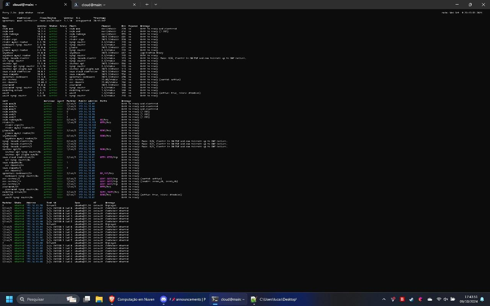
    /// caption
    Figura 2 - Comando “juju status” no terminal.
    ///

    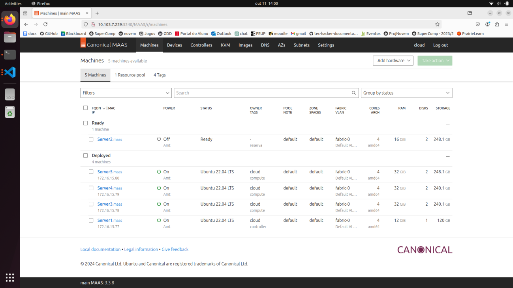
    /// caption
    Figura 3 - Dashboard do MAAS com as máquinas.
    ///

    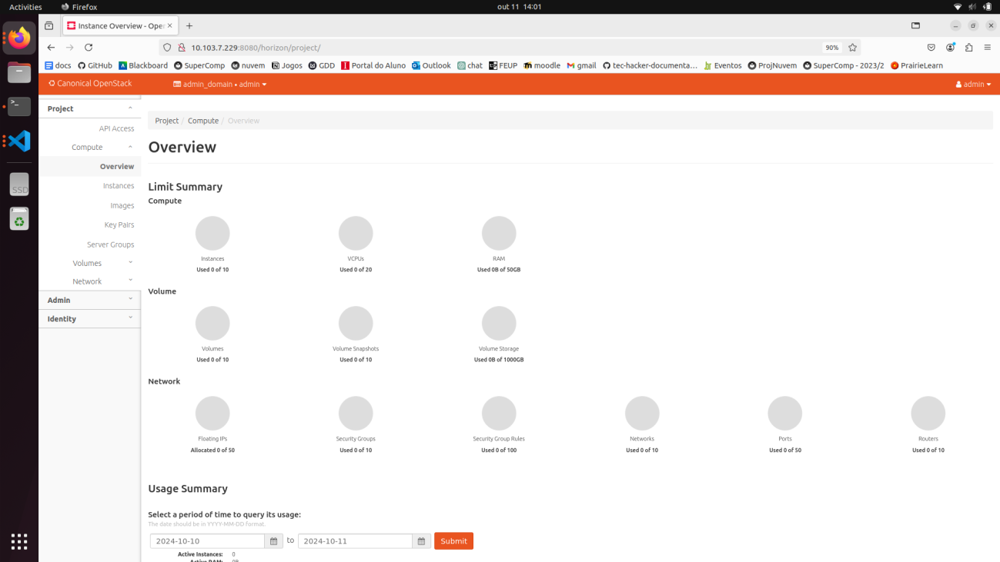
    /// caption
    Figura 4 - Aba Compute Overview no OpenStack.
    ///

    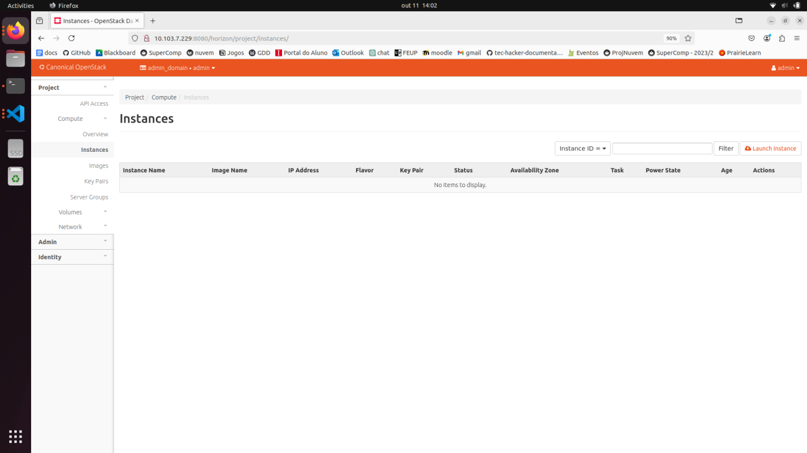
    /// caption
    Figura 5 - Aba Compute Instances no OpenStack.
    ///

    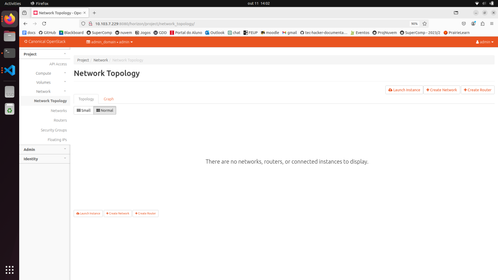
    /// caption
    Figura 6 - Aba Network Topoplogy no OpenStack.
    ///

### Passo 3: Imagens

### Passo 4: Flavors

### Passo 5: Rede Externa

### Passo 6: Rede Interna e Roteador

### Passo 7: Conexão

### Passo 8: Instância

??? Tarefa-2

    De um print das Telas abaixo:
        
        1. Do Dashboard do MAAS com as máquinas.
        2. Da aba compute overview no OpenStack.
        3. Da aba compute instances no OpenStack.
        4. Da aba network topology no OpenStack.

    Enumere as diferencas encontradas entre os prints das telas na Tarefa 1 e na Tarefa 2.

    Explique como cada recurso foi criado.

    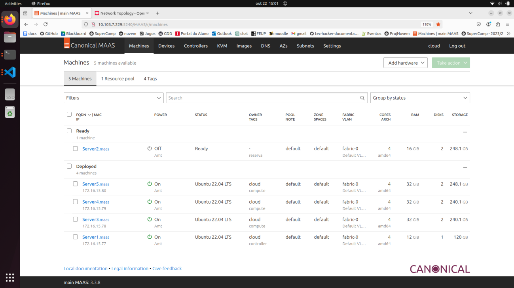
    /// caption
    Figura 7 - Dashboard do MAAS com as máquinas.
    ///

    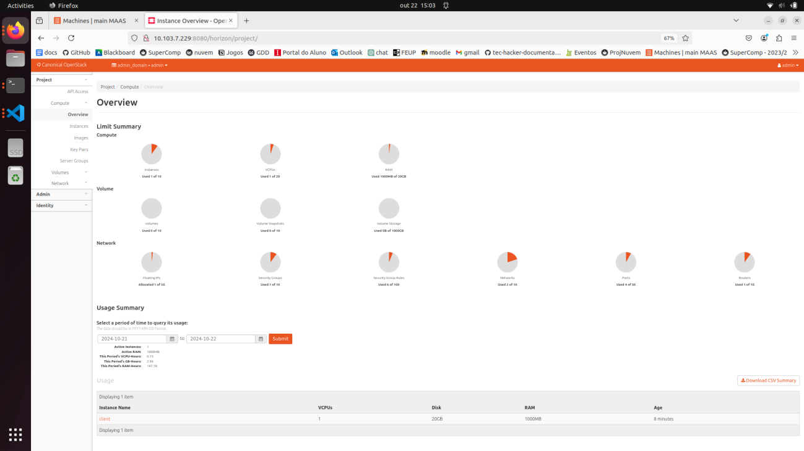
    /// caption
    Figura 8 - Aba Compute Overview no OpenStack.
    ///

    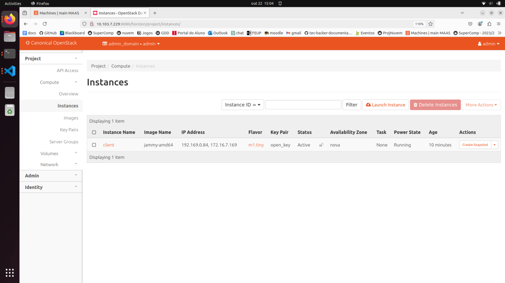
    /// caption
    Figura 9 - Aba Compute Instances no OpenStack.
    ///

    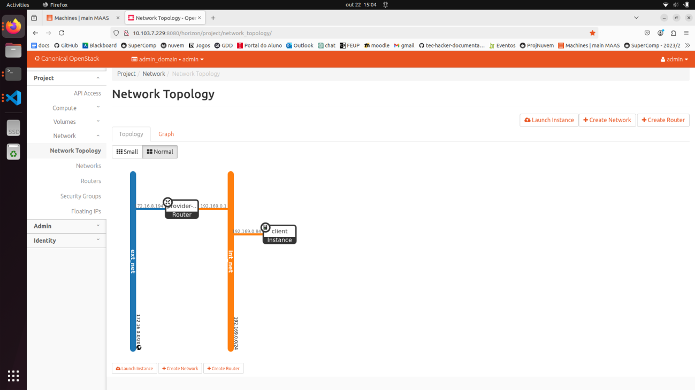
    /// caption
    Figura 10 - Aba Network Topoplogy no OpenStack.
    ///

    **Enumere as diferencas encontradas entre os prints das telas na Tarefa 1 e na Tarefa 2.**

    -  Compute overview: percebe-se que o número de Instâncias, VCPUs, Floating IPs, security groups e Routers atualizou para 1, pois eles foram criados. Além disso, a memória RAM agora está em 1GB, temos 6 rules dos security groups e a networks e a port atualizaram os valores, pois agora estamos utilizando instâncias; 
    -  Compute instances: criada a instância “cliente”; 
    -  Network topology: tem network, uma vez que foi criada a subnet e o roteador.

    **Explique como cada recurso foi criado.**

    Após importar as chaves de validação e imagem, e configurado a rede externa: 

    -  Rede interna e roteador: usar uma série de comandos para criar rede interna, subrede e roteador, colocando os devidos valores.

    ``` sh
    openstack network create int_net 
    openstack subnet create --network int_net --gateway 192.168.0.1 --subnet-range 192.168.0.0/24 --allocation-pool start=192.168.0.10,end=192.168.0.200 int_subnet 
    openstack router create provider-router 
    openstack router set --external-gateway ext_net provider-router 
    openstack router add subnet provider-router int_subnet
    ```

    -  Security Groups Rules: usar um comando 
    ``` sh
    openstack security group rule create
    ```

    - Instância: usar o comando a seguir passando a devida imagem, chave de validação e rede. 
    ``` sh
    openstack server create --image jammy-amd64 --flavor m1.small --key-name mykey --network int_net client
    ``` 

    -  Endereço de IP Flutuante: comandos abaixo, passando o nome do servidor criado anteriormente.  
    ``` sh
    FLOATING_IP=$(openstack floating ip create -f value -c floating_ip_address ext_net) openstack server add floating ip client $FLOATING_IP
    ```

### Escalando os nós

??? Tarefa-3

    Faça um desenho de como é a sua arquitetura de rede, desde a sua conexão com o Insper até a instância alocada.

    
    /// caption
    Figura 11 - Desenho da arquitetura de rede, da conexão com o Insper até a instância alocada.
    ///


## App - Uso da infraestrutura

Levantar 4 instâncias em máquinas virtuais do OpenStack: 2 instâncias com a API do projeto, 1 instância com banco de dados e 1 instância com LoadBalancer (Nginx). Configurando-as como indicado a seguir:

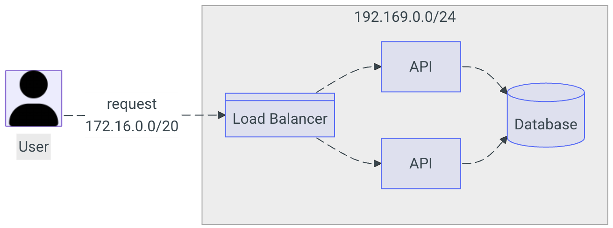
/// caption
Figura 12 - Topologia a ser configurada. Fonte: instruções da disciplina.
///

???+ Tarefa-4

    1. Escreva um relatório dos passos utilizados. 
    2. Anexe fotos e/ou diagramas contendo: arquitetura de rede da sua infraestrutura dentro do Dashboard do Openstack.
    3. Lista de VMs utilizadas com nome e IPs alocados 
    4. Print do Dashboard do Wordpress conectado via máquina Nginx/LB. 
    5. 4 Prints, cada um demonstrando em qual server  (máquina física) cada instancia foi alocado pelo OpenStack.

    **O relatório está presente na aba Relatório - Tarefa 4.**

## Conclusão

