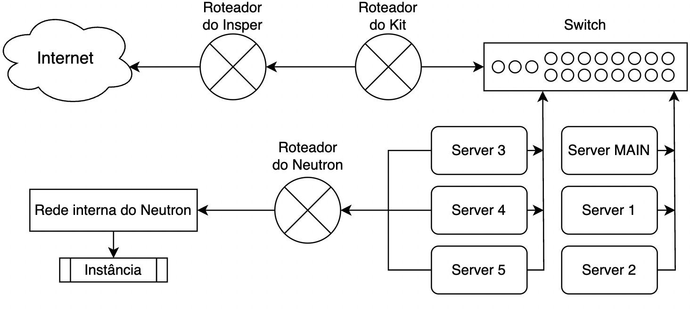
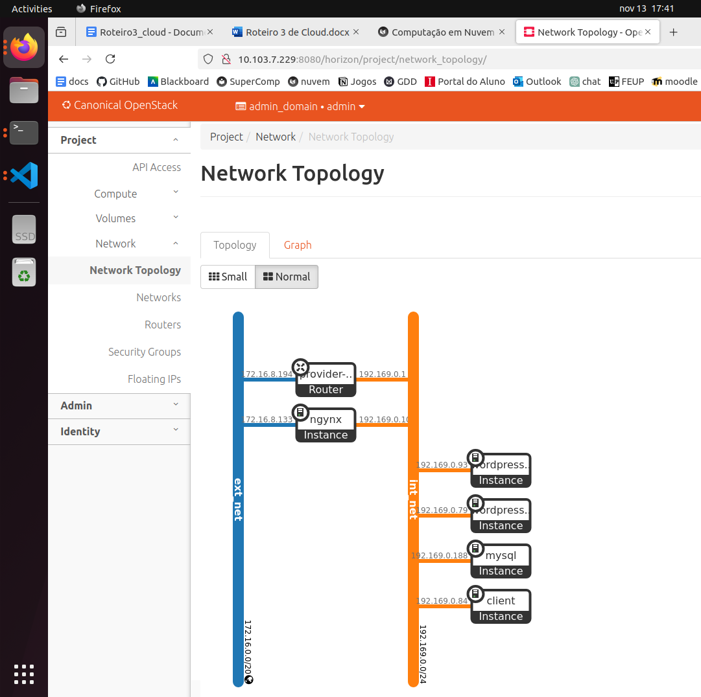
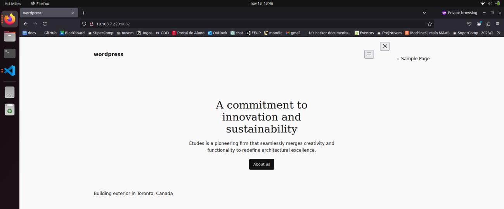
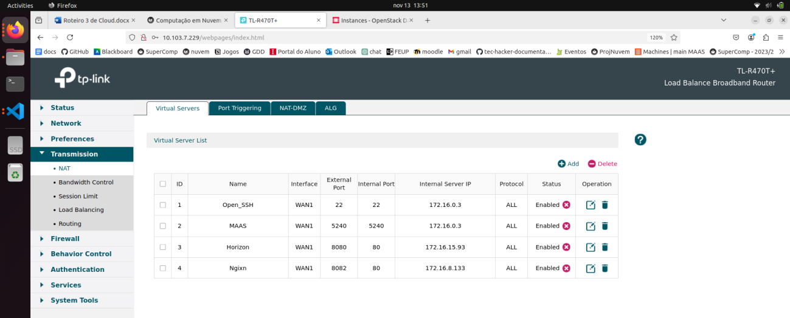
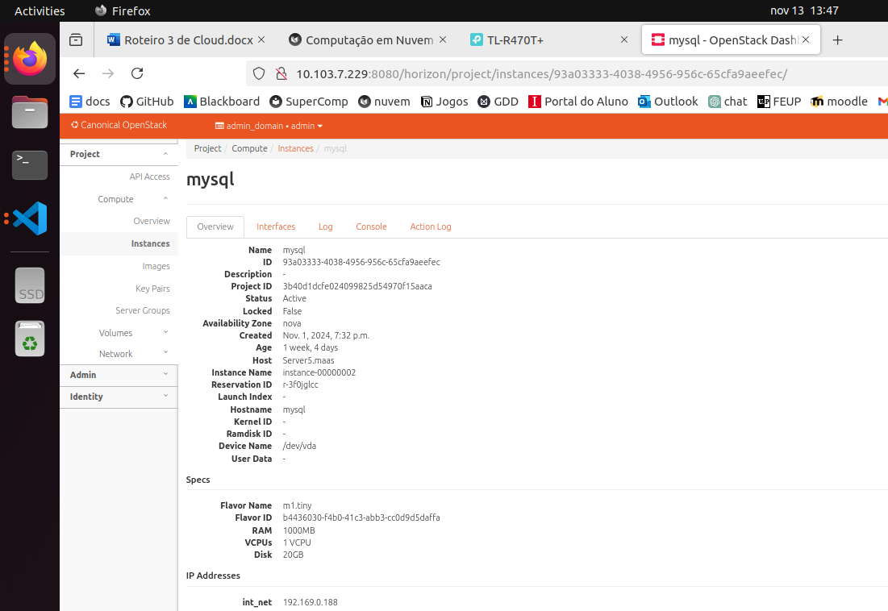
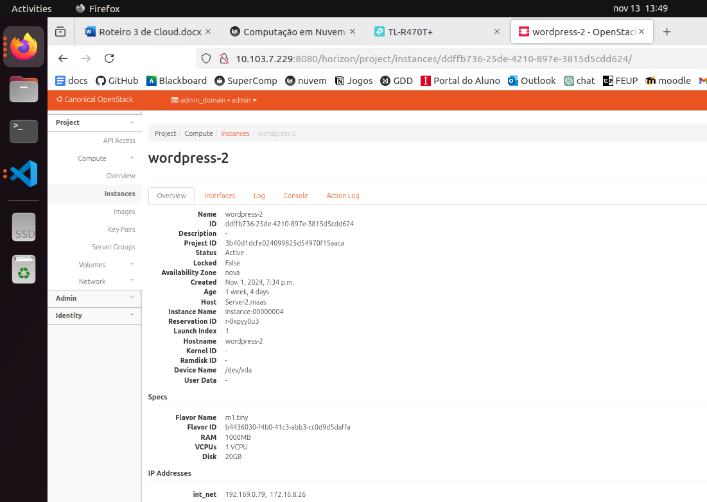
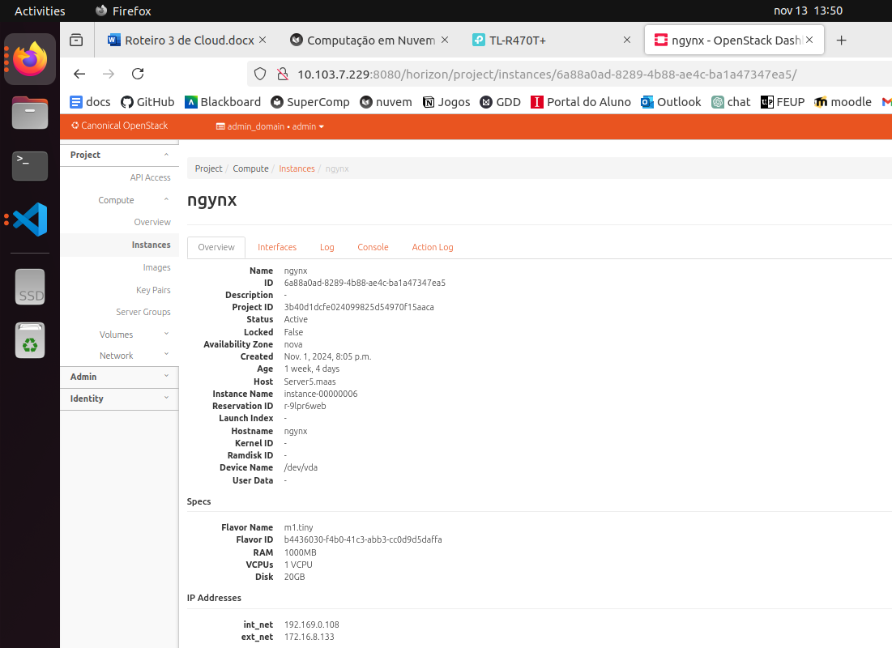

# Relatório

## Uso da Infraestrutura 

Com o objetivo de levantar uma aplicação com Nginx, WordPress e MySQL, foram realizados uma série de passos e comandos que serão explicados ao longo do relatório. 

## Instâncias 

Primeiramente, entrou-se no Dashboard do Openstack para criar as 4 instâncias necessárias na aba "Compute" --> "Instances" e para configurar as instâncias selecionar "Launch  Instance". Para a configuração, é necessário inserir alguns dados para cada uma: 

-  Nome da instância (aba Details) 
-  Selecionar source Image e alocar a imagem "jammy-amd64" (aba Source) 
-  Alocar o flavor m1.tiny (aba Flavor) 
-  Alocar a rede interna int_net (aba Network) 
-  Apenas para a instância nginx: também é preciso alocar a rede externa ext_net 

## MySQL 

Após criar a instância onde o servidor mysql irá rodar, ela foi acessada via ssh, e para isso foi adicionado um IP Flutuante. Após acessá-la, foi instalado o mysql (mysql server), via apt e, feito isso, os arquivos de configuração do mysql foram alterados para que o servidor sql fosse acessível de qualquer ponto da rede. Após realizada as alterações, o serviço foi reiniciado usando o comando do systemcl. Finalizando após confirmar que o servidor estava acessível externamente, foi adicionado um novo banco de dados chamado “WordPress” onde um novo usuário “cloud” foi dado permissão para realizar qualquer operação nessa data-base através de qualquer host (“%”), terminando assim as configurações do MySQL e removendo o IP flutuante da instância, isolando ele à rede interna. 

## Nginx 

Depois de criar a instância onde o servidor nginx irá rodar, ela foi acessada via ssh, e como neste caso a instância possui um IP externo, não foi necessário adicionar um IP flutuante para acessar a instância. Foi instalado o nginx via apt e após confirmar que o serviço estava funcionado e acessível remotamente foi adicionado na configuração padrão de sites o módulo “Upstream" e foi aplicada a regra para redirecionar qualquer chamada para os servidores "Apache Web” das instancias “WordPress”.

## WordPress 

Para a instalação e configuração das instâncias do “WordPress” foi adicionado um IP Flutuante em cada instância para conectar via ssh e após o acesso foram seguidos os passos do tutorial no link: https://ubuntu.com/tutorials/install-and-configure-wordpress#1-overview, instalando as dependências e o “Wordpress”, configurando o apache e, por fim, configurando o worpress para conectar à base de dados do mysql remoto em vez de local. Concluída a instalação e configuração do “Wordpress” em cada instância, os IPs Flutuantes foram removidos.

## Rede e Máquinas funcionando

/// caption
Figura 1 - Desenho da arquitetura de rede, da conexão com o Insper até as instâncias alocadas.
///

/// caption
Figura 2 - Arquitetura de rede da infraestrutura no Dashboard do Openstack.
///

/// caption
Figura 3 - Print do Dashboard do Wordpress conectado via máquina Nginx/LB. 
///

/// caption
Figura 4 - Print dos NATs existentes, mostrando o NAT do Nginx.
///

/// caption
Figura 5 - Print mostrando qual máquina a instância mysql foi alocada pelo OpenStack.
///

/// caption
Figura 6 - Print mostrando qual máquina a instância wordpress-1 foi alocada pelo OpenStack.
///

/// caption
Figura 7 - Print mostrando qual máquina a instância wordpress-2 foi alocada pelo OpenStack.
///

/// caption
Figura 8 - Print mostrando qual máquina a instância nginx foi alocada pelo OpenStack.
///
 

Para uma maior facilidade de visualização das VMs, com seus nomes, máquinas e IPs, consultar a Tabela 1 a seguir: 

|             | Nome        | Máquina    | IP alocado                   |
| :---------: | :---------: | :--------: | :--------------------------: |
| `MySQL`     | mysql       | Server 5   | 192.169.0.188                |
| `WordPress` | wordpress-1 | Server 5   | 192.169.0.93 - 172.16.7.26   |
| `WordPress` | wordpress-2 | Server 2   | 192.169.0.79 - 172.16.8.36   |
| `Nginx`     | ngynx       | Server 5   | 192.169.0.108 - 172.16.8.133 |
/// caption
Tabela 1 - VMs utilizadas, com seus nomes e IPs. 
///