## Objetivo

O objetivo principal desse roteiro é:

- entender os conceitos básicos Infraestrutura como código
- entender os conceitos básicos sobre SLA e DR

## Roteiro

Para visualizar o arquivo PDF feito e entregue, consultar o link a seguir: **[Roteiro 4 - PDF](./Roteiro_4_de_Cloud.pdf)**.

## Montagem do Roteiro

Infraestrutura como Código (IaC) é uma abordagem que automatiza o provisionamento e gerenciamento da infraestrutura por meio de arquivos de configuração, substituindo processos manuais. Isso garante ambientes padronizados, facilita a manutenção e evita alterações não documentadas.

O Terraform, ferramenta da HashiCorp, é amplamente utilizado em IaC por permitir a definição declarativa da infraestrutura, além de suportar múltiplos provedores de nuvem e facilitar o gerenciamento do ciclo de vida dos recursos com comandos como init, plan e apply.

Já o OpenStack oferece uma solução de IaaS flexível, permitindo gerenciar ambientes de nuvem privados e públicos. Com componentes como Domains, Projects, Users e Roles, organizados pelo Keystone (sistema de IAM), ele proporciona controle de acesso e segmentação de recursos em ambientes multiusuário.

## Infra

São criados um domínio, dois projetos e dois usuários "Aluno", um em cada projeto, no OpenStack via Horizon Dashboard.

## App

### Criando a Infraestrutura utilizando IaC

O Terraform conta com arquivos .tf, que definem a infraestrutura. Cada aluno entra no MAIN pela sua máquina e cria a estrutura abaixo.

``` tree title="Estrutura de pastas"
KitU_Aluno/  
  terraform/
    instance1.tf
    instance2.tf
    network.tf
    provider.tf
    router.tf
  KitU_Aluno-openrc.sh
```

### Credenciais do seu usuário

- entrar no dashboard com o login do usuário
- Project -> API Access
- fazer o download do openstack rc file do usuário
- copiar o conteudo para ```KitU_Aluno-openrc.sh```
- dar a permissão de execução para o arquivo
    ``` sh
    chmod +x KitU_Aluno-openrc.sh
    ```
- carregando as variáveis de ambiente
    ``` sh
    source ~/openstack-bundles/stable/openstack-base/openrc
    ```
    ``` sh
    source KitU_Aluno-openrc.sh
    ```

### Implementação da infraestrutura

- iniciar o terraform
    ``` sh
    terraform init
    ```
- criar um plano de execução
    ``` sh
    terraform plan
    ```
- mudanças aplicadas para alcançar o estado desejado da sua configuração
    ``` sh
    terraform apply
    ```

??? "Check-point: Admin"

    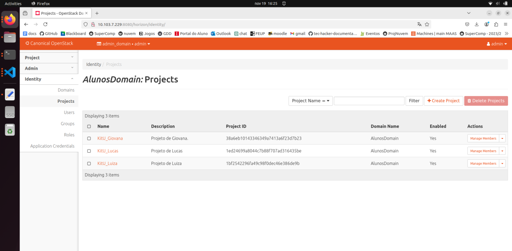
    /// caption
    Figura 1 - Aba Identity projects no OpenStack.
    /// 

    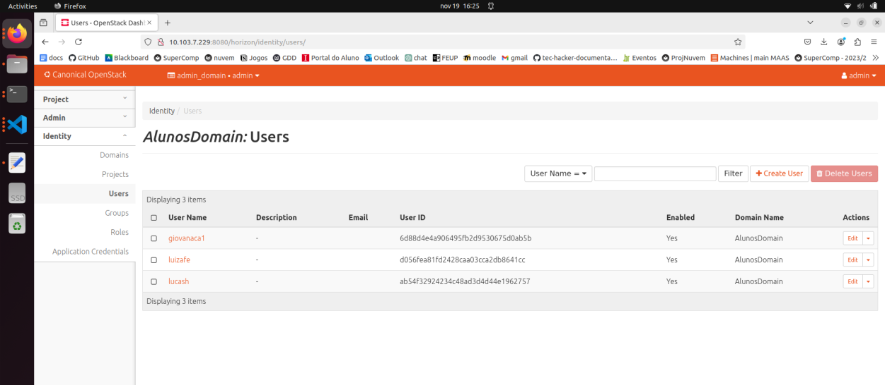
    /// caption
    Figura 2 - Aba Identity users no OpenStack.
    ///

??? "Check-point: Giovana"

    De um print das Telas abaixo:
    
        1. Da aba Identy projects no OpenStack.
        2. Da aba Identy users no OpenStack.
        3. Da aba compute overview no OpenStack.
        4. Da aba compute instances no OpenStack.
        5. Da aba network topology no OpenStack.

    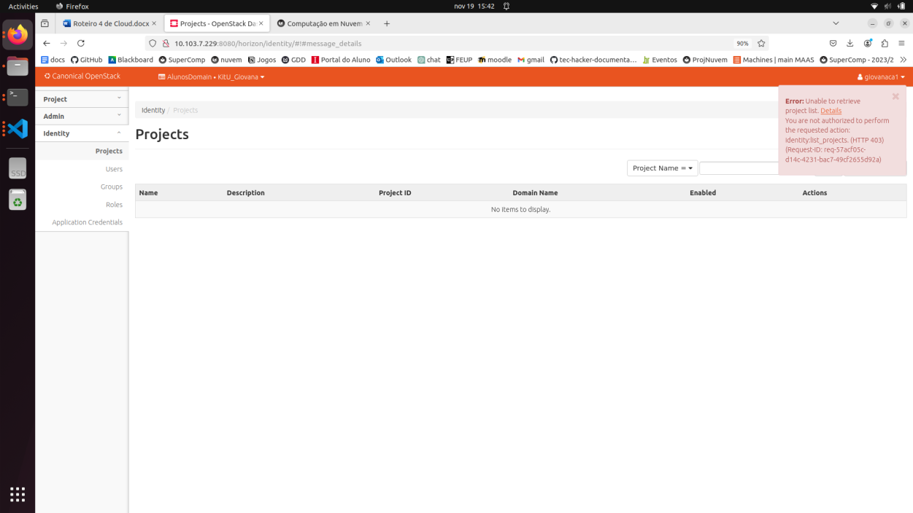
    /// caption
    Figura 3 - Aba Identity projects no OpenStack – Giovana.
    ///

    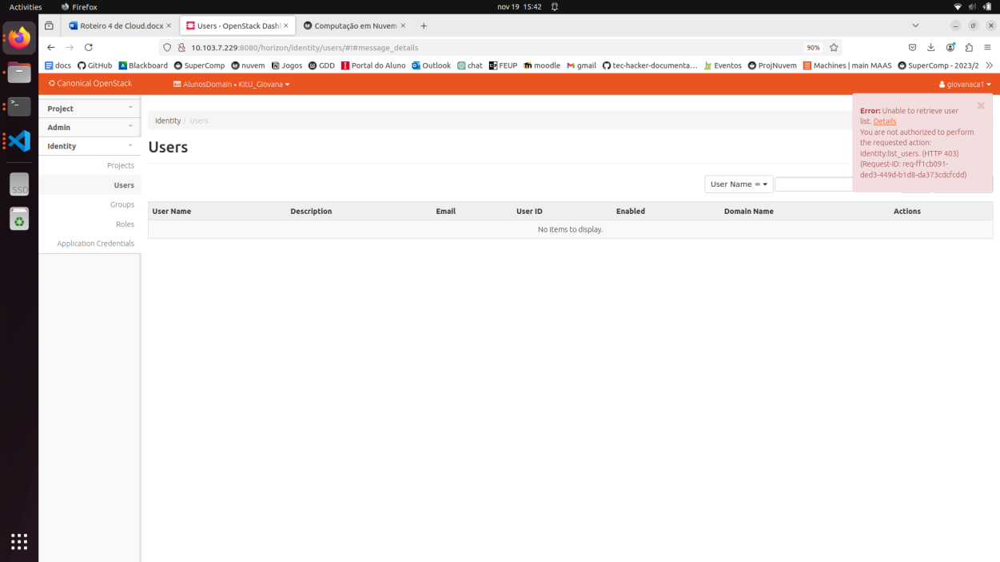
    /// caption
    Figura 4 - Aba Identity users no OpenStack – Giovana.
    ///

    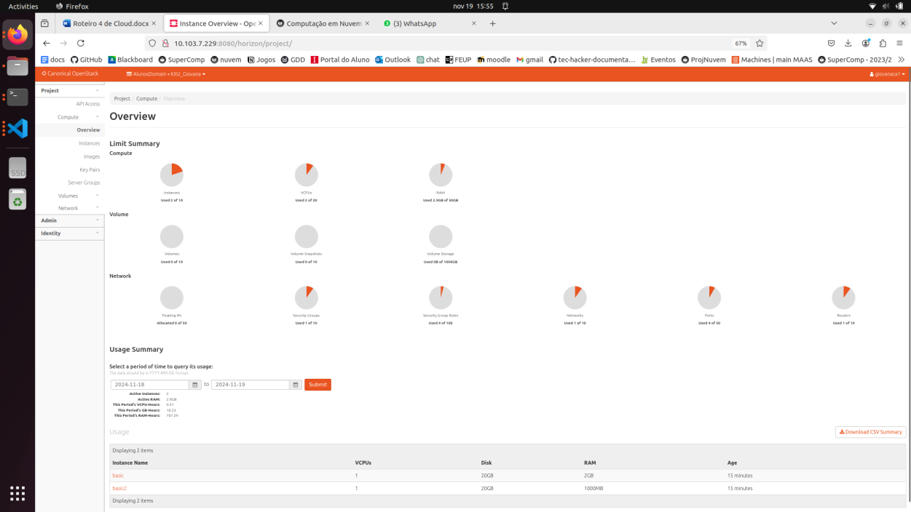
    /// caption
    Figura 5 - Aba Compute Overview no OpenStack – Giovana.
    ///

    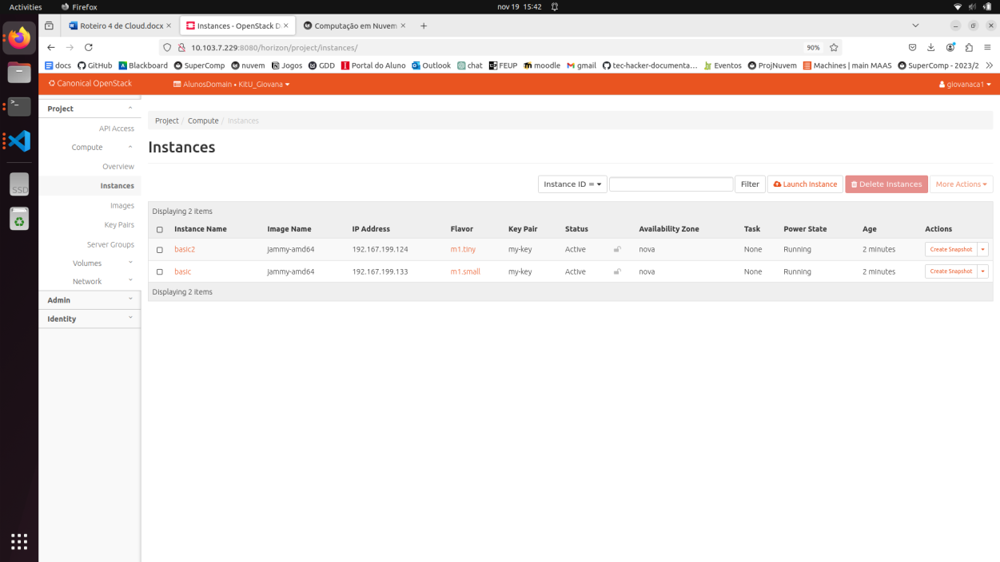
    /// caption
    Figura 6 - Aba Compute Instances no OpenStack – Giovana.
    ///

    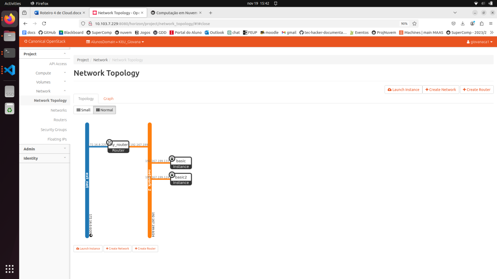
    /// caption
    Figura 7 - Aba Network Topology no OpenStack – Giovana.
    ///

    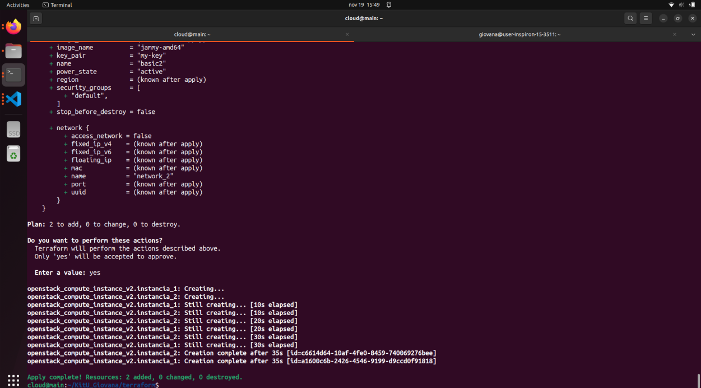
    /// caption
    Figura 8 - Print do terminal com terraform apply completo – Giovana. 
    ///

??? "Check-point: Lucas"

    De um print das Telas abaixo:
    
        1. Da aba Identy projects no OpenStack.
        2. Da aba Identy users no OpenStack.
        3. Da aba compute overview no OpenStack.
        4. Da aba compute instances no OpenStack.
        5. Da aba network topology no OpenStack.

    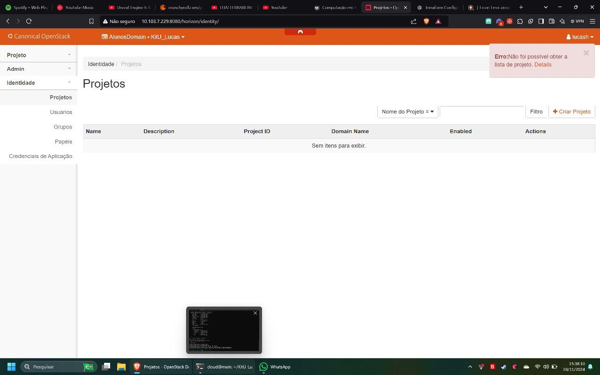
    /// caption
    Figura 9 - Aba Identity projects no OpenStack – Lucas.
    ///

    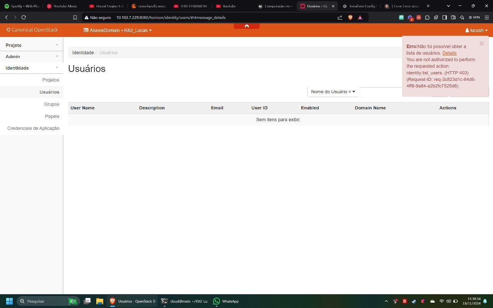
    /// caption
    Figura 10 - Aba Identity users no OpenStack – Lucas.
    ///

    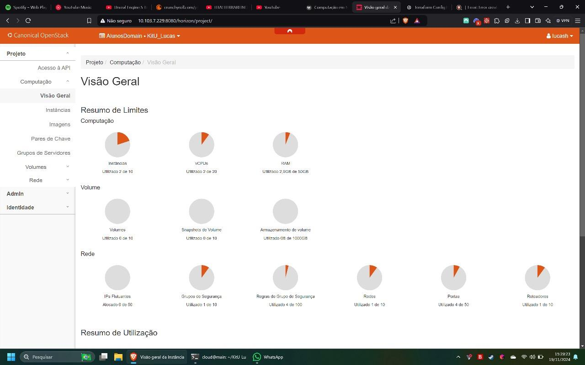
    /// caption
    Figura 11 - Aba Compute Overview no OpenStack – Lucas.
    ///

    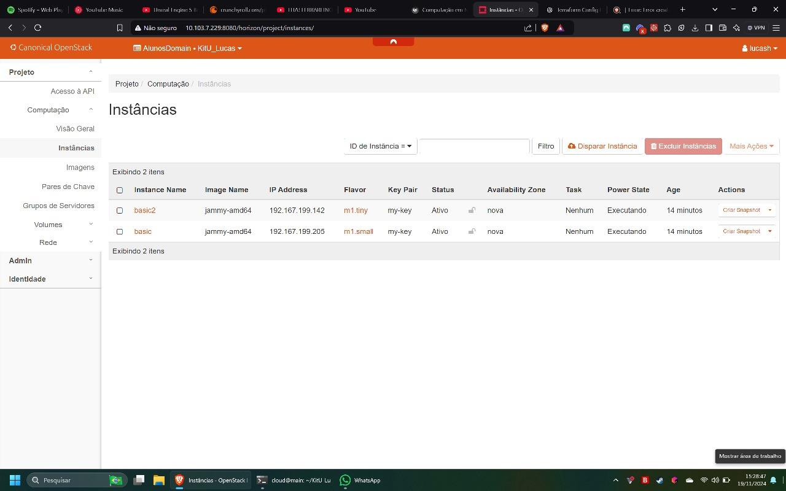
    /// caption
    Figura 12 - Aba Compute Instances no OpenStack – Lucas.
    ///

    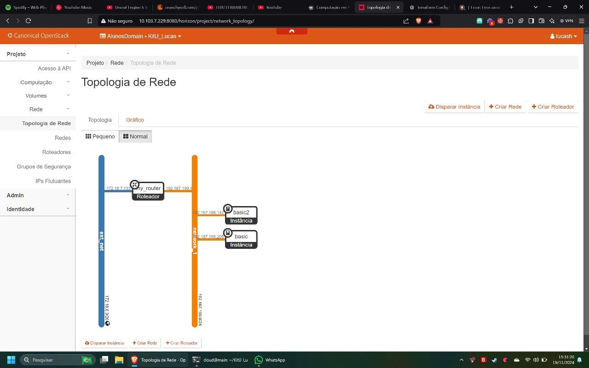
    /// caption
    Figura 13 - Aba Network Topology no OpenStack – Lucas.
    ///

    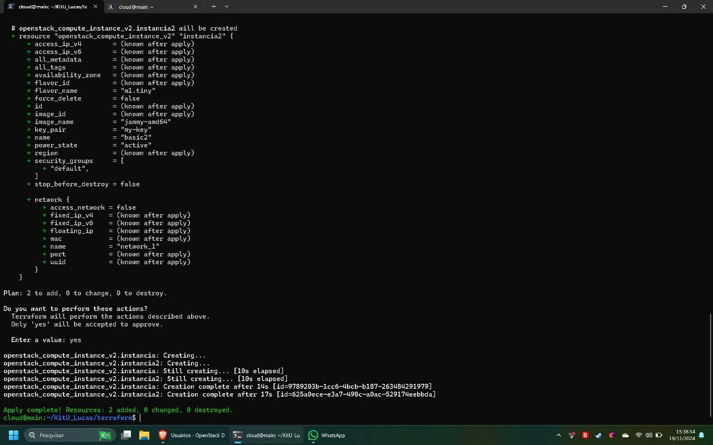
    /// caption
    Figura 14 - Print do terminal com terraform apply completo – Lucas.
    ///

## Conclusão

Neste roteiro, foi possível compreender e aplicar conceitos fundamentais de Infraestrutura como Código (IaC) e gestão de identidade e acesso em nuvens privadas. 

Ao interagir com o OpenStack por meio do Horizon Dashboard, o entendimento sobre a estrutura organizacional e os mecanismos de controle de acesso dessa plataforma foi consolidado.

A integração do Terraform com o OpenStack demonstrou a importância de configurar corretamente as credenciais, recursos de rede e instâncias de máquina virtual.

Por fim, o roteiro introduziu conceitos importantes relacionados a SLA (Acordo de Nível de Serviço) e DR (Recuperação de Desastres).